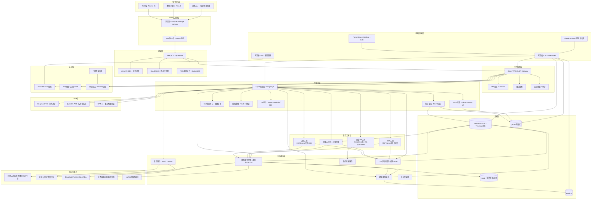
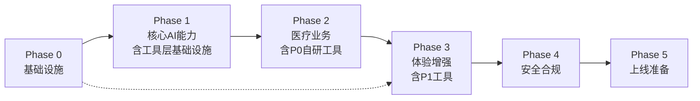

<!-- Generated by Trae Work -->
# GerClaw 技术选型推荐

> **版本**: v1.1
> **日期**: 2026-06-30
> **基于**: 17份技术调研报告综合决策

---

## 1. 选型总览

### 1.1 选型原则

GerClaw 作为面向老年群体的医疗 AI 平台，技术选型遵循以下六大核心原则（按优先级排序）：

1. **医疗合规优先**：所有选型必须满足《个人信息保护法》《数据安全法》《互联网诊疗管理办法》《生成式人工智能服务管理暂行办法》等法规要求，数据不出境、敏感信息加密存储、AI 生成内容强制标注、三级等保合规。
2. **生产就绪性**：面向日均万级 DAU 的企业级系统，优先选择经过大规模生产验证、社区活跃、文档完善的技术方案，避免使用实验性或停止维护的项目。
3. **技术栈兼容性**：以 Next.js 15 + React + Vercel AI SDK + Tailwind CSS + ShadCN UI 为前端基座，后端选择能与该栈高效协作的技术，最大化代码复用率（小程序端通过 Taro 4 共享 70%-85% 业务逻辑）。
4. **老年场景适配**：所有技术选择必须服务于老年用户体验——语音交互优先、大字体高对比度、操作流程极简、弱网环境可用、容错性强。
5. **成本可控**：在满足合规与性能的前提下，优先使用开源/免费方案（PostgreSQL/TimescaleDB/Redis/Qdrant/医学开源Python工具），商业组件（DrugBank/中文 DDI 数据源/商业医疗API）分阶段采购。
6. **学习曲线合理**：团队以 React/TypeScript 为主力技能，后端优先选择 Go 或 Python（FastAPI），医学工具层以 Python 生态为主（pip 包+MCP协议统一接入），避免引入过多异构技术栈增加维护成本。

### 1.2 技术栈全景图

### 1.3 选型决策矩阵

| 模块 | 推荐方案 | 备选方案 | 不推荐方案 |
|------|---------|---------|-----------|
| AI 记忆模块 | 自研三层记忆（会话/短期/长期）+ Mem0 启发 | LangChain Memory、Zep | 纯向量存储、无记忆分层 |
| 医疗 LLM 基座 | DeepSeek-V3（API）+ Qwen2.5-72B（私有化备选） | GPT-4o（复杂任务兜底）、通义千问-Max | 纯国产小模型（<70B）、纯 GPT（数据出境风险） |
| 对话引擎/问卷交互 | Vercel AI SDK + 自研对话状态机 + LLM 自适应提问 | LangChain Chain、Dify 工作流 | 纯硬编码表单、无状态对话 |
| 联网搜索 | Tavily API（英文/通用）+ 博查搜索（中文医疗） | SerpAPI、Bing Search API | 纯爬虫自建（合规风险）、无搜索 |
| RAG 检索系统 | Qdrant + BGE-M3 Embedding + 混合检索（向量+BM25+重排） | Milvus、Weaviate、Chroma | 纯向量检索（无关键词匹配）、无重排 |
| Skill 系统 | 自研 Skill 注册中心 + OpenAI Function Calling 格式 + 语义版本管理 | LangChain Tools、AutoGPT Plugins | 硬编码工具调用、无版本控制 |
| Agent 编排框架 | LangGraph（状态图编排）+ 自研 Agent Harness Loop | CrewAI、AutoGen、Dify | 纯 ReAct 循环（无状态管理）、LangChain Agent（生产不稳定） |
| 基础设施与部署 | 阿里云 ACK（K8s）+ Vercel（前端）+ Docker 容器化 | 阿里云 ECS（弹性伸缩）、AWS EKS | 物理机部署、Serverless 全栈（冷启动问题） |
| 数据安全与隐私 | 应用层 AES-256-GCM + 动态脱敏 + KMS 密钥管理 + 审计日志 | 静态脱敏、差分隐私（分析场景） | 明文存储、前端脱敏（后端可见） |
| Agent 设计模式 | Coordinator-Expert 模式（协调员+专家Agent）+ 9源上下文组装 | MDT 会诊模式（多专家讨论） | 单 Agent 全功能、星座模式（复杂度高） |
| 语音交互 | 阿里云 ASR/TTS（中文老年优化）+ Silero VAD + 微信同声传译（小程序） | 讯飞开放平台、腾讯云 ASR/TTS | 纯 Web Speech API（中文识别率差）、无 VAD |
| CGA 量表引擎 | 自研规则引擎（JSON DSL）+ LLM 对话化采集 + 自动计分 | 表单引擎（如 Formily）+ LLM 辅助 | 纯纸质量表数字化（无对话化）、纯 LLM 评分（准确性差） |
| 用药审查引擎 | 混合方案：规则引擎（DrugBank+中文 DDI）+ KG（Neo4j）+ LLM 增强 | 纯规则（覆盖不足）、纯 LLM（幻觉风险） | 纯 LLM 审查（医疗安全不可接受） |
| 健康画像存储 | PostgreSQL 16 + TimescaleDB 2.x + Redis 7 + IndexedDB（Dexie.js） | MongoDB（备选文档库）、InfluxDB（纯时序） | MongoDB 主存储（SSPL 许可+事务弱）、纯 InfluxDB（缺关系查询） |
| 前端适老化 UI | Tailwind CSS + ShadCN UI 改造 + CSS 变量主题系统 + ARIA 无障碍 | Ant Design（适配成本高）、Material UI | 纯默认组件库（不适老）、纯大字体（缺少交互适配） |
| 小程序跨端 | Taro 4（React 18 + Vite）+ NutUI-React + pnpm workspace Monorepo | uni-app x（Vue 技术栈）、原生微信小程序 | mpvue（已停更）、Remax（社区萎缩）、kbone（性能差） |
| **医学工具层** | **分层工具集成架构（自研CGA/用药/公式核心工具 + pip集成通用开源库 + MCP协议统一接入 + 商业API补充）** | 纯商业API集成方案、全自研方案 | 纯LLM工具调用（无确定性保障）、直接pip安装无封装（安全不可控） |

---

## 2. 各模块选型详情

### 2.1 AI 记忆模块

**推荐方案**：自研三层记忆架构（会话记忆/短期记忆/长期记忆），参考 Mem0 设计理念，长期记忆采用"结构化字段（PostgreSQL JSONB）+ 向量检索（Qdrant）"混合存储。

**备选方案**：Zep（开源记忆服务）、LangChain Buffer/Vector Memory。

**不推荐方案**：纯向量数据库存储所有记忆（缺乏结构化查询能力）、无记忆分层（上下文窗口溢出）、Mem0 云服务（医疗数据不出境要求）。

**选型理由**：
1. 医疗场景需要精确的结构化记忆（过敏史、用药列表、诊断编码），纯向量检索无法保证 100% 召回关键信息。
2. 三层记忆设计符合临床思维：会话记忆（当前对话上下文）→ 短期记忆（近期就诊摘要，7天内）→ 长期记忆（过敏史/慢病/家族史等持久信息）。
3. 自研方案可完全控制数据存储位置和加密策略，满足医疗数据合规要求。
4. Mem0 的设计理念（自动记忆提取、重要性评分、时间衰减）可借鉴，但不直接使用其云服务。
5. 参考 01 报告中 Letta/MemGPT 的记忆管理思想（核心记忆/归档记忆/召回记忆），实现类似人类记忆的分层管理。

**迁移成本**：中（需自研记忆提取和召回 Pipeline，但核心算法有开源参考）。

**关键配置/注意事项**：
- 记忆提取必须经过脱敏处理，身份证号/手机号等 PHI 不得写入记忆向量库。
- 用药/过敏等关键安全信息必须同时写入结构化字段，不能仅依赖向量检索。
- 记忆更新采用追加写入+定期摘要压缩策略，避免记忆无限增长。
- AI 引用记忆内容时必须标注信息来源和时间（如"根据您2026年3月的记录..."）。

---

### 2.2 医疗 LLM 基座模型

**推荐方案**：DeepSeek-V3 API 作为主力对话模型，Qwen2.5-72B 作为私有化部署备选（敏感场景），GPT-4o 作为复杂医学推理的兜底模型。

**备选方案**：通义千问-Max（阿里云生态）、文心一言 4.0（百度生态）、DeepSeek-R1（推理增强）。

**不推荐方案**：纯开源小模型（<70B，医疗知识不足）、纯 GPT-4（数据出境合规风险+成本高）、纯国产中等模型（对话流畅度和推理能力不足）。

**选型理由**：
1. DeepSeek-V3 在中文医疗基准（CMB/CMExam）上表现优异，API 价格极具竞争力（输入约 2元/百万Token），适合万级 DAU 的成本控制。
2. Qwen2.5-72B 支持阿里云私有化部署（PAI-EAS），满足核心诊疗场景的数据不出境要求。
3. GPT-4o 在复杂医学推理、多模态理解（药品图片识别/检验单 OCR）上仍有优势，作为兜底可显著降低错误率。
4. 采用"模型路由"策略：常规对话→DeepSeek-V3，敏感健康数据→私有化 Qwen，复杂推理→GPT-4o。
5. 所有模型输出必须经过 AI 护栏层过滤，禁止给出确定性诊断结论。

**迁移成本**：低（通过 Vercel AI SDK 统一抽象，切换模型仅需更换 Provider 配置）。

**关键配置/注意事项**：
- API Key 通过环境变量注入，服务端调用，前端不暴露任何密钥。
- 设置 Temperature=0.3-0.5（医疗场景保守），Top-p=0.9，减少创造性输出。
- 配置系统 Prompt 明确约束：AI 定位为健康咨询助手，不做诊断、不开处方、不推荐具体处方药用量。
- 所有 AI 回复末尾强制追加免责声明："本内容由 AI 生成，不作为诊断依据，请咨询专业医生。"
- 建立模型输出质量监控体系，定期抽检 AI 回复的医学准确性。

---

### 2.3 对话引擎/问卷交互

**推荐方案**：Vercel AI SDK（流式响应 + Tool Calling）+ 自研对话状态机（Finite State Machine）+ LLM 驱动的自适应问卷引擎。

**备选方案**：LangChain Chain + 自定义状态管理、Dify 工作流引擎（可视化编排）。

**不推荐方案**：纯硬编码表单（老年体验差）、无状态对话（无法完成量表评估等多步任务）、纯 LLM 自由对话（流程不可控）。

**选型理由**：
1. Vercel AI SDK 与 Next.js 15 深度集成，天然支持 React Server Components 和流式 UI，开发体验最佳。
2. 自研对话状态机确保 CGA 量表等结构化流程的可靠性——每个量表有明确的状态转换规则，LLM 负责问题的自然语言表达和追问，但流程由状态机控制。
3. 自适应提问：LLM 根据老人回答动态调整问题顺序和措辞（如认知功能差的老人简化问题、情绪低落时先安抚），但评分规则严格按量表标准执行。
4. 支持"打断-恢复"机制：老人可随时切换话题，AI 记忆当前评估进度并在适当时机引导回来。
5. 单次 CGA 评估分 2-3 次完成（每次 15-20 分钟），避免老年用户疲劳。

**迁移成本**：中（状态机和问卷引擎需自研，但 Vercel AI SDK 大幅降低流式对话开发量）。

**关键配置/注意事项**：
- 量表评分逻辑必须由确定性代码执行，LLM 仅负责问题表述和答案理解，不得让 LLM 直接给出评分。
- 对话状态机支持"回退"操作——老人纠正回答时可回退到上一题。
- 评估流程严格遵循临床推荐顺序：认知(MMSE/MoCA)→情绪(GDS-15)→功能(ADL/IADL)→营养(MNA-SF)→跌倒→用药。
- 对话中定期总结已收集信息，让老人确认："我理解您说的是...对吗？"

---

### 2.4 联网搜索

**推荐方案**：Tavily API（英文医学文献/通用搜索）+ 博查搜索 API（中文医疗搜索）+ 医疗权威源白名单过滤。

**备选方案**：SerpAPI（Google 搜索）、Bing Custom Search API、SearXNG 自建。

**不推荐方案**：纯爬虫自建搜索引擎（法律合规风险+维护成本高）、无搜索能力（AI 知识过时）、无来源过滤（可能引用非权威医疗信息）。

**选型理由**：
1. Tavily 专为 AI Agent 设计，返回结构化摘要而非原始 HTML，Token 消耗低，支持搜索深度控制。
2. 博查搜索在中文医疗领域覆盖好，可搜索到丁香园、好大夫、春雨医生等中文医疗平台内容。
3. 医疗搜索必须有白名单机制——仅信任 NMPA、FDA、WHO、国家卫健委、UpToDate、丁香园等权威来源的信息。
4. 搜索结果作为 RAG 的补充知识源，不直接作为 AI 回复内容，需经 LLM 综合整理并标注来源。
5. 老年用户常见查询（药品说明、疾病科普、医院信息）优先走 RAG 知识库，搜索用于补充最新信息（如疫情动态、新药获批）。

**迁移成本**：低（搜索 API 接入简单，主要工作在搜索结果后处理和过滤逻辑）。

**关键配置/注意事项**：
- 搜索结果必须标注来源 URL 和发布时间，AI 引用时附带来源。
- 医疗建议类搜索结果需经过时效性过滤（优先 1 年内内容）。
- 搜索查询需经 LLM 重写优化，将老年口语化表达转换为医学术语搜索。
- 设置搜索频率限制，避免每次对话都触发搜索（成本控制+延迟控制）。
- 不得搜索返回处方药购买渠道、违禁医疗广告内容。

---

### 2.5 RAG 检索系统

**推荐方案**：Qdrant 向量数据库 + BGE-M3（多语言多功能 Embedding 模型）+ 混合检索（向量相似度 + BM25 关键词 + BGE-Reranker 重排）+ LlamaIndex 作为 RAG 框架。

**备选方案**：Milvus（大规模向量检索）、Weaviate（混合搜索内置）、Chroma（轻量原型）。

**不推荐方案**：纯向量检索（中文医疗术语匹配不准）、无重排（Top-K 精度不足）、LangChain 原生 RAG（灵活性差）。

**选型理由**：
1. Qdrant 性能优秀（Rust 编写），支持过滤条件检索、Payload 存储，单节点可支撑亿级向量，运维比 Milvus 简单。
2. BGE-M3 支持稠密+稀疏+多向量三种检索模式，中文医疗文本检索效果优于 OpenAI text-embedding-3，且可私有化部署。
3. 混合检索策略：向量检索处理语义相似性，BM25 处理精确医学术语匹配（如 ICD-10 编码、药品通用名），二者融合后经 BGE-Reranker 重排提升精度。
4. 参考 05 报告的 RAG 演进路线：Naive RAG→Advanced RAG（分块/索引/检索优化）→Modular RAG→Agentic RAG，GerClaw 从 Advanced RAG 起步。
5. 医疗知识库建设分层次：药品说明书库、临床指南库、老年医学知识库、常见问题库，各库独立索引+跨库检索。

**迁移成本**：中（知识库建设和质量调优需要持续投入，技术框架搭建相对成熟）。

**关键配置/注意事项**：
- 医疗文档分块策略：按语义段落分块（512-1024 Token），保留章节标题等元数据作为上下文。
- Embedding 模型使用中文医疗领域微调版本（如 BGE-M3 在 CMedQAv2 上微调）提升检索精度。
- 检索结果必须带来源追溯（文档名、章节、页码/段落 ID），AI 回复中标注参考来源。
- 建立检索质量评估 Pipeline（Recall@K/MRR/NDCG），持续优化检索效果。
- 向量数据与结构化数据关联存储，药品交互知识等精确信息不走 RAG，走规则引擎。

---

### 2.6 Skill 系统

**推荐方案**：自研 Skill 注册中心，采用 OpenAI Function Calling 兼容的 JSON Schema 格式定义 Skill，支持语义版本管理（SemVer）、A/B 测试、灰度发布。

**备选方案**：LangChain Tools（生态丰富但版本管理弱）、AutoGPT Plugins（过于开放，安全风险）。

**不推荐方案**：硬编码工具调用函数（无法动态更新）、无版本控制的自由注册（医疗场景安全不可控）、直接使用第三方 Plugin 市场（不可控代码执行风险）。

**选型理由**：
1. 医疗场景的 Skill（如"查询药物相互作用""执行 CGA 评分""发送用药提醒"）需要严格的权限控制和版本管理，自研方案最可控。
2. OpenAI Function Calling 格式已成为业界事实标准，Vercel AI SDK、LangGraph 等框架原生支持。
3. Skill 分为三类：(a) 安全只读 Skill（查知识库、查药品信息）；(b) 用户操作 Skill（设提醒、记录体征）；(c) 高风险 Skill（处方建议、紧急呼叫），需人工确认。
4. 参考 06 报告的 Skill 自进化机制：通过用户反馈和医生审核持续优化 Skill 描述和参数，但上线前必须经过医疗专家审核。
5. 支持 Skill 热加载，新 Skill 上线无需重启服务。

**迁移成本**：中（自研注册中心和管理后台，但核心协议已标准化）。

**关键配置/注意事项**：
- 高风险 Skill（用药建议、转诊建议）必须配置"人工确认"拦截器，AI 不能自动执行。
- Skill 调用参数必须经过校验（Zod Schema），防止 LLM 产生幻觉参数。
- 所有 Skill 调用记录完整审计日志（调用者/参数/结果/时间）。
- Skill 版本回滚机制：新版本 Skill 出现问题可一键回滚到上一个稳定版本。
- 医疗相关 Skill（如 CGA 评分、DDI 查询）的业务逻辑由确定性代码实现，LLM 仅负责参数提取。

---

### 2.7 Agent 编排框架

**推荐方案**：LangGraph 作为核心编排框架（状态图驱动），自研 Agent Harness Loop（计划→执行→观察→反思→修正循环），采用 Coordinator-Expert 多 Agent 模式。

**备选方案**：CrewAI（角色协作）、AutoGen（微软多 Agent 对话）、Dify（低代码平台）。

**不推荐方案**：纯 ReAct 循环（无状态管理，复杂任务易失控）、LangChain Agent Executor（生产环境不稳定，错误处理弱）、Dify 全托管（灵活性不足，定制困难）。

**选型理由**：
1. LangGraph 基于图的状态机模型天然适合医疗场景的多步推理和分支逻辑，支持持久化状态、人工中断、时间旅行调试等企业级特性。
2. Coordinator-Expert 模式（参考 10 报告对 Claude Code 架构的分析）：一个协调 Agent 负责理解用户意图并分发任务，专家 Agent（CGA 专家/用药专家/搜索专家/语音专家）各司其职，避免单 Agent 能力过载。
3. 自研 Harness Loop 在 LangGraph 基础上增加：医疗安全检查点（每步执行前验证安全约束）、错误恢复机制（工具调用失败自动重试/降级）、人机协作节点（高风险操作转人工）。
4. 参考 07 报告分析：LangGraph 的持久化检查点（checkpoint）机制支持长对话中断恢复，适合 CGA 评估等分次完成的场景。
5. 上下文组装参考 Claude Code 的多源策略：系统指令 + Tool Schema + 用户画像 + 对话历史 + 记忆召回 + 工具结果 + 安全护栏。

**迁移成本**：中（LangGraph 有学习曲线，但 API 设计清晰，文档完善）。

**关键配置/注意事项**：
- Agent 最大执行步数限制（默认 10 步），防止无限循环消耗 Token。
- 每个 Agent 节点设置超时时间（默认 30 秒），超时自动降级。
- 所有 Agent 决策路径可追溯（LangGraph 内置 trace），便于事后审计和调试。
- 医疗安全护栏作为图中的条件边，每次工具调用前/后均需经过安全检查。
- 初期不引入过多 Agent（3-5 个核心 Agent），避免编排复杂度过高。

---

### 2.8 基础设施与部署

**推荐方案**：阿里云 ACK（托管 Kubernetes）作为后端容器编排平台，Vercel 部署前端 Next.js 应用，Docker 容器化所有服务，GitHub Actions + 阿里云云效 CI/CD。

**备选方案**：阿里云 ECS + 弹性伸缩（初期简化）、腾讯云 TKE（成本相当）、AWS EKS（海外业务考虑）。

**不推荐方案**：物理机/传统虚拟机部署（弹性差、运维成本高）、全 Serverless 架构（AI 推理冷启动延迟不可接受）、自建 K8s 集群（运维复杂度高）。

**选型理由**：
1. 阿里云是国内医疗云的主流选择，通过等保三级/四级认证，符合医疗数据合规要求，ACK 托管 K8s 减少运维负担。
2. Vercel 是 Next.js 的官方部署平台，全球 CDN 加速、Edge Functions、自动 HTTPS、Preview Deployments 等特性大幅提升前端开发和部署效率。
3. Docker 容器化保证开发/测试/生产环境一致性，配合 K8s 实现水平弹性伸缩应对流量波动。
4. 参考 08 报告的高并发方案：AI 对话服务采用队列削峰+流式响应，RAG/记忆服务做读写分离，Redis 缓存热点数据。
5. 监控体系采用 Prometheus + Grafana（指标）+ Loki（日志）+ Jaeger（链路追踪），全栈可观测。

**迁移成本**：中（K8s 运维有学习曲线，但 ACK 托管版降低了复杂度）。

**关键配置/注意事项**：
- 所有服务部署在阿里云国内区域（上海/杭州），医疗数据不得出境。
- 生产环境至少 3 个可用区部署，保证高可用。
- AI 推理服务配置 GPU 节点池（如阿里云 gn7i/gn6i），支持 Qwen2.5-72B 私有化部署。
- 配置 HPA（水平 Pod 自动伸缩），CPU/内存/QPS 多维度触发扩缩容。
- 建立完整的 CI/CD 流水线：代码提交→自动化测试→镜像构建→灰度发布→全量发布。
- 数据库备份策略：每日全量+实时 WAL 归档，RPO<15分钟，RTO<4小时。

---

### 2.9 数据安全与隐私

**推荐方案**：分层安全体系——传输层 TLS 1.3、存储层 AES-256-GCM（信封加密+KMS）、应用层动态脱敏（PHI 实时识别与替换）、审计层 WORM 存储不可篡改日志。

**备选方案**：静态脱敏（适合数据分析场景）、差分隐私（统计聚合场景）、联邦学习（多中心研究场景，后期考虑）。

**不推荐方案**：明文存储医疗数据（违法）、仅前端脱敏（后端仍可见明文）、硬编码密钥（泄露风险极高）。

**选型理由**：
1. 医疗数据属于敏感个人信息，《个人信息保护法》《数据安全法》要求最高级别保护，分层防御是安全最佳实践。
2. 参考 09 报告：动态脱敏优于静态脱敏——数据在数据库中以加密形式存储，查询时根据用户权限和场景动态解密/脱敏（如医生看全量、客服看脱敏、AI 训练看匿名化数据）。
3. PHI 识别采用"正则+NER 模型"双重检测：正则覆盖身份证/手机号/银行卡等结构化 PHI，医疗 NER 模型识别姓名/住址/疾病等非结构化 PHI。
4. 信封加密（Envelope Encryption）方案：Root KEK 存储在阿里云 KMS（HSM 硬件保护），User KEK 由 Root KEK 加密存储，Data DEK 由 User KEK 加密存储，三级密钥体系定期轮换。
5. 所有敏感操作（登录、查询病历、修改诊断、导出数据、删除账户）写入不可篡改审计日志，保留≥5年。

**迁移成本**：中（加密和脱敏逻辑需要在应用层实现，但有成熟库支持）。

**关键配置/注意事项**：
- 模型 API 调用前必须脱敏：将用户输入中的真实姓名替换为"患者"、身份证号/手机号替换为[REDACTED]后再发给第三方模型 API。
- 密钥绝对不得写入代码或 .env 文件提交 Git，通过 KMS/环境变量/密钥管理服务注入。
- .gitignore 必须包含：.env、*.pem、*.key、secrets/、credentials/ 等所有可能含密钥的文件。
- 建立数据分类分级制度：S4绝密（身份证/医保卡号）、S3高（姓名/手机号/病史）、S2中（体征数值/评估等级）、S1低（系统配置）。
- 定期进行安全渗透测试和漏洞扫描，每季度至少一次。
- 数据不得出境，服务器全部部署在国内阿里云区域，备份同样在国内。

---

### 2.10 Agent 设计模式

**推荐方案**：Coordinator-Expert 模式（1 个协调 Agent + 4-6 个专家 Agent），上下文组装采用多源策略（系统指令+工具Schema+用户画像+记忆+对话历史+工具结果+护栏）。

**备选方案**：MDT 会诊模式（复杂病例多专家讨论，后期引入）、单 Agent 全功能（MVP 阶段可用于简单场景）。

**不推荐方案**：星座模式（任意 Agent 间通信，复杂度爆炸）、纯 Plan-and-Execute（计划过于刚性，不适合对话场景）、无状态 Agent（无法支撑连续健康管理）。

**选型理由**：
1. 参考 10 报告对 Claude Code、Devin、Cursor 等成功 Agent 产品的分析，Coordinator-Expert 是生产环境验证最成熟的模式——协调者负责理解意图和调度，专家负责领域任务，职责清晰。
2. 老年医疗场景的专家 Agent 可明确划分为：(1) 问诊对话 Agent（症状收集+健康咨询）；(2) CGA 评估 Agent（量表对话化+评分）；(3) 用药审查 Agent（DDI+剂量+Beers 检查）；(4) 搜索 Agent（医学信息检索）；(5) 记忆管理 Agent（信息提取+记忆更新）。
3. 上下文窗口管理策略：核心指令始终置顶，用户画像/关键记忆压缩注入，对话历史滑动窗口（保留最近 20 轮，更早的自动摘要），工具结果按需引用。
4. 错误处理遵循"失败安全"原则：Agent 不确定时主动告知用户并建议转人工医生，不编造信息。
5. 人机协作节点设计：高风险决策（如发现严重药物交互、疑似急症）自动触发"转人工"流程，AI 不做最终判断。

**迁移成本**：低（模式选择主要影响 Prompt 设计和图结构，技术框架已确定为 LangGraph）。

**关键配置/注意事项**：
- 协调 Agent 的 System Prompt 必须包含明确的任务分发规则和安全约束。
- 每个专家 Agent 有独立的 System Prompt 和可用 Tool 集合，最小权限原则。
- Agent 间传递信息时必须做安全过滤，防止注入攻击。
- 建立 Agent 决策的可解释性机制——用户可追问"为什么给我这个建议"，AI 需给出推理过程和依据。
- 初期专家 Agent 数量控制在 5 个以内，避免调度复杂度过高。

---

### 2.11 语音交互

**推荐方案**：阿里云智能语音交互（ASR + TTS）作为主力语音服务，Silero VAD 进行语音活动检测（中文老年场景参数调优），微信小程序端使用微信同声传译插件（免费+原生体验）。

**备选方案**：讯飞开放平台（中文 ASR 准确率高，价格略贵）、腾讯云 ASR/TTS（与微信生态集成好）。

**不推荐方案**：纯 Web Speech API（中文识别率低，方言支持差）、无 VAD 直接全量上传（延迟高+成本高）、仅 TTS 无 ASR（只能听不能说，交互不完整）。

**选型理由**：
1. 阿里云 ASR 支持中文多方言（粤语/四川话/河南话等），对老年人不标准普通话识别率高，实时流式识别延迟<300ms。
2. Silero VAD 是开源轻量级 VAD 模型（<1MB 参数），可本地运行，参考 11 报告针对老年人语速慢、停顿多的特点优化参数（trig_sum=0.30, neg_trig_sum=0.10, min_silence_samples=800）。
3. 微信同声传译插件免费且原生集成在小程序中，老年用户无需额外授权即可使用，适合 MVP 阶段快速上线。
4. TTS 选择温暖亲和的中老年音色（如阿里云"知琪"或"知佳"），语速默认 0.9 倍（稍慢），支持用户调节语速和音量。
5. 全双工语音对话方案：VAD 检测到语音→流式 ASR→实时字幕展示→AI 流式回复→TTS 流式播放，类电话通话体验。

**迁移成本**：低（云服务 API 接入成熟，SDK 完善）。

**关键配置/注意事项**：
- 语音输入按钮必须足够大（最小 56x56px，老年模式推荐 64x64px），提供明确的"按住说话/松开结束"视觉反馈。
- ASR 识别结果实时展示为文字字幕，老人可在发送前编辑纠正识别错误。
- 紧急场景（如老人说"我不舒服"/"胸痛"）AI 需优先识别紧急关键词，触发紧急求助流程（拨打 120/通知紧急联系人）。
- 语音功能必须有明确的开关控制，尊重用户隐私（部分老人不喜欢被录音）。
- 语音数据传输加密，录音文件原则上不持久化存储，如需用于模型优化需用户单独授权并脱敏。
- 方言支持优先级：普通话→粤语→四川话→河南话→其他方言，按用户群体分布逐步扩展。

---

### 2.12 CGA 量表引擎

**推荐方案**：自研 CGA 规则引擎（JSON DSL 定义量表结构/评分规则/分级标准）+ LLM 对话化采集层 + 自动计分与结果解读，核心量表包括 Barthel/Katz ADL、Lawton IADL、MMSE、MoCA、GDS-15、MNA-SF、Morse/Tinetti 跌倒量表。

**备选方案**：表单引擎（Formily/Amis）+ LLM 辅助提问（但对话化体验差）、FHIR Questionnaire + LLM（标准化但灵活性不足）。

**不推荐方案**：纯纸质量表数字化（点选式表单，老年体验差）、纯 LLM 自由对话评分（评分准确性无法保证，不合规）。

**选型理由**：
1. CGA 量表的评分规则必须 100% 准确——这是临床决策的依据，不能依赖 LLM 的推理能力。规则引擎确保评分逻辑确定性，LLM 负责自然语言交互。
2. 参考 12 报告的评估流程：认知(MMSE/MoCA)→情绪(GDS-15)→功能(ADL/IADL)→营养(MNA-SF)→跌倒→用药，顺序固定但表达灵活。
3. JSON DSL 设计：每个量表定义为 JSON Schema，包含题目列表、选项/分值、跳转逻辑、分级阈值、结果解读模板。新增量表无需修改代码，仅需添加 JSON 配置。
4. LLM 对话化层将生硬的量表题目转化为自然对话（如将 MMSE 的"请说出这三个物品的名称"转化为"爷爷/奶奶，我现在说三样东西，您跟着我重复一遍好吗？皮球、国旗、树木"）。
5. 单次评估分 2-3 次完成，每次 15-20 分钟，评估进度自动保存，支持跨会话续评。

**迁移成本**：中（量表 DSL 定义和 LLM 对话化 Prompt 工程需要医学专家参与调优）。

**关键配置/注意事项**：
- MMSE 评分严格使用中文版文化程度调整划界分（文盲≤17/小学≤20/中学≤24）。
- 认知功能评估优先于其他量表——若 MMSE<10 分（重度认知障碍），后续自评量表（GDS/MNA）需由照护者代评。
- 评估结果自动生成结构化报告，包含各维度得分、分级解释、干预建议，并标注"AI 辅助评估，仅供参考，需医生确认"。
- 高危结果（如重度抑郁 GDS≥12、高跌倒风险、重度认知障碍）自动触发通知家属/医生机制。
- 量表数据以 FHIR QuestionnaireResponse 格式存储，便于与医院系统互操作。

---

### 2.13 用药审查引擎

**推荐方案**：三层混合审查架构——(1) 规则引擎层（Drools 或自研 JSON 规则 DSL）处理确定性 DDI/剂量/禁忌检查；(2) 知识图谱层（Neo4j）处理 CYP 酶/转运体/基因等多跳推理；(3) LLM 增强层处理说明书抽取、文献挖掘、患者易懂的解释生成。数据源：DrugBank（DDI 规则）+ RxNorm/OpenFDA（免费标准化）+ NMPA+丁香园/药智网（中文药品数据）+ Beers 2023/STOPP-START/中国 PIM 目录。

**备选方案**：纯规则引擎（MVP 阶段可先用，覆盖 80% 常见交互）、商业 CDSS 系统（如 UpToDate Lexicomp，贵但成熟）。

**不推荐方案**：纯 LLM 审查（幻觉风险，医疗安全不可接受）、纯 DrugBank 英文数据（中文药品覆盖不足）、无老年人专用标准（Beers/STOPP 必须覆盖）。

**选型理由**：
1. 参考 13 报告的 10 步 MedReview-Pipeline：患者画像构建→药物实体标准化→DDI 检测（规则+KG+LLM 三层）→药物-疾病禁忌→药物-食物交互→过敏检查→重复用药→剂量审查（含老年/肝肾调整）→Beers/STOPP 筛查→风险评分与报告生成。
2. 规则引擎做基础拦截：DrugBank 约 240 万条 DDI 交互对、Beers 2023 的 115+ 条 PIM 规则、STOPP/START v2 的 114 条规则、中国老年人 PIM 目录（2017 版 72 种/类）、肝肾功能剂量调整表——这些必须 100% 精确执行。
3. 知识图谱补充规则无法覆盖的间接交互（如"药物A抑制CYP3A4→药物B（CYP3A4底物）血药浓度升高→药物B与药物C交互增强"）。
4. LLM 层用于：(a) 从中文药品说明书中 NLP 抽取交互信息补充规则库；(b) 生成患者易懂的用药指导（避免医学术语堆砌）；(c) 交互机制的自然语言解释。
5. 风险分级三级标记：🔴禁忌/严重（强制拦截，必须医生确认）、🟡警告（弹窗提示，需确认）、🟢提示（信息栏展示）。

**迁移成本**：高（数据源采购/整理、规则编码、知识图谱构建需要医学团队深度参与，是 GerClaw 最核心的业务模块）。

**关键配置/注意事项**：
- 用药审查引擎必须 100% 覆盖 Beers 2023 和 STOPP/START v2 的老年人专用标准。
- 剂量审查必须考虑老年人特殊调整：≥65 岁起始剂量减半原则、肾功能 eGFR 分段剂量调整、肝功能 Child-Pugh 分级调整。
- Polypharmacy（多重用药）预警：≥5 种长期用药自动标记，≥10 种触发 Deprescribing（药物精简）评估建议。
- 药物实体标准化是关键难点：中文商品名→通用名→ATC 编码→RxCUI 的映射表需要持续维护。
- 所有 AI 生成的用药建议必须标注证据等级（★★★ DrugBank/★★☆ 文献/★☆☆ KG 推理）。
- 处方审查全流程留痕，医生确认/药师审核记录完整保存≥15年（互联网诊疗病历留存要求）。
- MVP 阶段可先用"规则引擎+LLM"双层架构，KG 层在 Phase 3 引入。

---

### 2.14 健康画像存储

**推荐方案**：PostgreSQL 16 + TimescaleDB 2.x 作为核心主存储（结构化+JSONB 文档+时序 Hypertable 三位一体），Redis 7 做缓存层，IndexedDB（Dexie.js）做浏览器端访客/离线存储，Neo4j 作为二期可选知识图谱增强。

**备选方案**：MongoDB（文档模型灵活但 SSPL 许可+事务弱）、InfluxDB（纯时序但缺关系查询）、MySQL + 额外时序库（运维复杂度高）。

**不推荐方案**：MongoDB 作为主存储（SSPL 许可商业不友好、多表 JOIN 能力弱）、纯 InfluxDB（无法处理复杂关系查询）、Neo4j 作为主存储（图数据库不适合通用 CRUD）。

**选型理由**：
1. 参考 14 报告的详细对比：PostgreSQL + JSONB 提供了接近文档数据库的灵活性（健康画像结构多变），同时保持 ACID 事务和强关系查询能力（用户-病史-用药-评估强关联）。
2. TimescaleDB 作为 PG 扩展天然集成，单数据库搞定核心数据+体征时序数据（血压/血糖/心率等），支持连续聚合、自动压缩（90%+ 压缩率），无需额外部署 InfluxDB。
3. Redis 用于：热点用户画像缓存、分布式锁（并发写冲突）、同步版本号水位、Session 管理、限流计数。
4. IndexedDB（Dexie.js 封装）支持访客模式（零门槛体验，不强制注册）和 PWA 离线使用，访客数据可一键迁移到注册账号。
5. 数据同步采用"版本号增量拉取+SSE 推送"模型（类似 CouchDB/PouchDB replication），多设备冲突分字段解决（LWW/OR-Set/幂等写入）。

**迁移成本**：低（PostgreSQL 是最成熟的开源数据库，生态和人才储备充足）。

**关键配置/注意事项**：
- 核心 Schema 采用"三层混合"：高频查询字段用 PG 原生列（加索引），多变数据用 JSONB（加 GIN 索引），体征数据用 TimescaleDB Hypertable（按 7 天 chunk 分区）。
- 敏感字段（身份证号/姓名/手机号/住址）使用 AES-256-GCM 应用层加密，密钥由 KMS 管理。
- 软删除（deleted_at）而非物理删除，满足被遗忘权时在 30 天冷静期后执行硬删除+备份清理。
- 数据导出支持 FHIR R4 Bundle JSON 格式（标准互操作）+ PDF 健康报告（人可读）。
- 备份策略：每日全量备份（加密上传 OSS）+ WAL 实时归档（PITR），保留 30 天日备/12 个月周备/7 年年备。
- 每季度执行一次恢复演练，验证备份可用性（RTO<4h，RPO<15min）。

---

### 2.15 前端适老化 UI

**推荐方案**：以 Tailwind CSS + ShadCN UI 为基础，通过 CSS 变量主题系统实现老年模式切换，改造核心组件（Button/Input/Card/Nav）满足适老化标准，全面支持 ARIA 无障碍属性和屏幕阅读器。

**备选方案**：Ant Design（企业级组件库但适老化改造量大）、Material UI（Google 设计语言但不符合国内老年人使用习惯）。

**不推荐方案**：直接使用默认组件库不做改造（字号小、按钮小、对比度不足）、仅放大字体（交互模式不适老）、完全另写一套老年版代码（维护成本翻倍）。

**选型理由**：
1. 参考 15 报告的详细设计规范：Tailwind CSS 的定制化能力最强，可通过 `tailwind.config.ts` 定义完整的老年模式字号/间距/配色体系；ShadCN UI 基于 Radix UI 构建，原生支持 ARIA 属性和键盘导航，无障碍基础最好。
2. CSS 变量主题切换方案：通过 `<html data-elderly="true">` 属性切换老年模式，支持三档字号调节（正常18px/大20px/超大24px基准）、高对比度模式（黑底金/白字）、语音朗读开关，无需刷新页面即时生效。
3. 适老化核心参数：正文≥18px、对比度≥4.5:1（AAA 级推荐7:1）、主按钮≥56x56px、输入框≥52px高、行高≥1.6、无广告弹窗、核心功能3步内到达。
4. 成功案例借鉴：微信关怀模式（听文字消息）、支付宝长辈模式（首页精简+防诈骗提醒）、国家医保平台（核心功能4个入口）、12306 爱心版（电话客服兜底+无广告）。
5. 组件改造：所有交互组件支持 aria-label/aria-describedby/aria-invalid 等 ARIA 属性，按钮支持适老化尺寸 variant，图标必须配文字标签（禁止纯图标按钮）。

**迁移成本**：中（组件改造和主题配置一次性投入，但后续新组件遵循规范即可）。

**关键配置/注意事项**：
- 老年模式默认首页仅保留 4-6 个核心入口：问医生、买药、健康档案、挂号、我的、急救（红色常驻按钮）。
- 主色推荐深青绿(#0F766E)或深红橙(#C2410C)，避免蓝紫/黄白/红绿配色组合（老年人色觉退化），背景使用暖白(#FFFEF7)而非纯白。
- 高危操作（提交问诊、确认购药、删除数据）必须二次确认弹窗，弹窗按钮间距≥20px，确认按钮红色、取消按钮灰色。
- 紧急呼叫（拨打120）按钮在老年模式下常驻底部导航，红色醒目大按钮。
- 提供电话客服/人工医生入口，每页可见或一键直达。
- 支持 Web Speech API 文字朗读（医生回复、药品说明一键朗读）和语音输入（输入框旁麦克风按钮）。
- 老年模式状态持久化（localStorage），下次打开自动保持。
- 严禁任何广告插件、营销弹窗、诱导点击按钮（工信部明确要求）。

---

### 2.16 小程序跨端

**推荐方案**：Taro 4（React 18 + Vite 编译模式）+ NutUI-React 组件库，采用 pnpm workspace + Turborepo Monorepo 架构管理 Web 端（Next.js）和小程序端（Taro）共享代码，整体复用率 70%-85%。

**备选方案**：uni-app x（Vue 技术栈，生态好但与 React 不兼容）、原生微信小程序（性能最优但代码复用率<10%）。

**不推荐方案**：mpvue（已停止维护）、Remax（社区萎缩）、kbone（性能差，仅适合简单展示页）、Mpx（Vue 生态，与 React 技术栈不兼容）。

**选型理由**：
1. 参考 16 报告的四方案详细对比：Taro 4 的 React/TSX 一等公民支持与 Next.js/React 技术栈一致性最高（复用率 70%-85%），Hooks、Zustand store、TypeScript 类型、API Client、工具函数均可直接共享。
2. NutUI-React 是京东官方维护的 React 组件库，Taro 多端适配完善，支持大字号/高对比度定制，京东健康等医疗小程序已有 Taro 实践先例。
3. Taro 4 正式支持 Vite 编译，HMR 速度快，开发体验接近 Next.js；支持微信/支付宝/百度/字节/QQ 多端小程序 + H5 + React Native（未来扩展 App）。
4. Monorepo 代码共享策略：packages/shared-types（类型100%共享）、api-client（HTTP适配器模式，90%共享）、hooks（业务逻辑80%共享）、store（Zustand 85%共享）、utils（工具函数95%共享），UI 层独立实现但遵循统一设计 Token。
5. 微信生态特殊能力深度集成：微信同声传译（免费语音）、微信支付（购药/问诊付费）、订阅消息（用药提醒/随访通知）、手机号一键授权登录。

**迁移成本**：中（Taro 有一定学习曲线，主要是编译约束和平台 API 差异，但 React 开发人员 1-2 周可上手）。

**关键配置/注意事项**：
- 严格遵守微信小程序包大小限制：主包<2MB，采用分包策略（评估/用药/个人/档案各分包），图片全部 CDN + WebP 格式。
- SSE 流式响应使用 `wx.request` 的 `enableChunked` 模式（基础库 2.14.0+，覆盖率>99%），降级方案为 WebSocket。
- 医疗小程序资质要求：MVP 阶段定位"健康信息咨询"（ICP 备案+三级等保），正式运营需《互联网医院许可证》《互联网药品信息服务资格证》。
- 所有 AI 回复必须标注"AI 生成，不作为诊断依据"，接入微信内容安全 API（msgSecCheck）审核文本。
- 本地缓存的健康数据使用 AES 加密存储，不存明文。
- 医疗数据不得出境，后端 API 服务器部署在国内。
- 提供亲情账户功能：子女可绑定父母账户协助操作和管理，参考支付宝/医保平台的亲情账户模式。

---

### 2.17 医学工具层

**推荐方案**：分层工具集成架构——自研核心工具（CGA评分/Beers规则/医学公式/DDI管线）+ pip 集成通用开源医学Python库 + MCP（Model Context Protocol）协议统一接入 + 商业API补充。通过工具注册中心统一管理，MCP Server 标准化暴露，LangGraph Agent Harness 调度调用，前端 Vercel AI SDK 渲染工具结果。

**备选方案**：
- **纯商业API集成方案**：全部依赖商业医疗API（如UpToDate Lexicomp、百度灵医智惠、腾讯觅影等），优点是开箱即用精度高，缺点是成本极高（年费用数十万起）、数据出境风险、供应商锁定、无法定制老年专科规则。
- **全自研方案**：所有医学工具从零自研，优点是完全可控，缺点是开发周期长（CGA/DDI/术语库等需数年积累）、重复造轮子、难以追赶医学知识更新速度。

**不推荐方案**：
- **纯LLM工具调用（无确定性工具封装）**：让LLM直接"记忆"医学知识并生成结果，无确定性代码保障，医疗安全不可接受——评分/计算/DDI检测必须由确定性代码执行。
- **直接pip安装无封装**：在Agent环境中直接pip install所有医学包供LLM自由调用，缺乏权限控制、参数校验、结果验证、审计日志，存在注入攻击和错误结果风险。
- **LangChain Tools散装集成**：不通过统一注册中心和MCP协议，直接用LangChain Tool装饰器零散集成，版本管理混乱、无法跨语言复用、安全策略不一致。

**选型理由**：
1. **分层策略平衡可控性与效率**：核心安全敏感工具（CGA评分、Beers规则、DDI检测、医学公式）自研确保100%确定性；通用成熟工具（medspaCy/MedCAT/Biopython/presidio）通过pip集成避免重复造轮子；MCP协议实现跨语言、跨进程的标准化工具调用；商业API补充开源无法覆盖的能力（循证医学LLM、语音医疗、药品数据库）。
2. **MCP协议是工具层标准化的关键**：参考17号报告，MCP（Model Context Protocol）提供统一的工具发现、调用、流式传输协议，自研工具、pip包、商业API均可封装为MCP Server，Agent通过MCP Client统一调用，避免N种集成方式N种维护成本。
3. **开源Python医学生态成熟度高**：medspaCy/scispaCy/MedCAT/presidio/Biopython等30+开源工具经过学术界和工业界验证，覆盖文献检索、NLP、术语标准化、隐私脱敏、药物信息等通用能力，pip一键安装即可使用。
4. **自研工具聚焦GerClaw老年专科差异化**：CGA八量表评分、Beers/STOPP规则、老年医学公式库、DDI管线、SOAP病历提取、老年综合征评估——这些老年专科工具无成熟开源替代，是GerClaw的核心壁垒，必须自研。
5. **工具安全多层防护**：工具注册中心实现权限分级（只读/操作/高风险）、参数校验（JSON Schema/Pydantic）、红旗拦截（危险操作自动拦截）、人在回路（高风险工具需人工确认）、调用次数限制（防滥用）、审计日志（全链路可追溯），满足医疗安全要求。

**P0必装Python工具清单**（MVP首版上线必须集成）：

| 工具名 | 推荐版本 | pip安装命令 | 用途 |
|--------|---------|------------|------|
| medspaCy | ≥1.0 | `pip install medspacy` | 临床文本NLP处理（分句/实体/否定检测/章节分割） |
| negspacy | ≥1.0 | `pip install negspacy` | 临床实体否定检测（基于NegEx算法），与medspaCy配合 |
| scispaCy | ≥0.5.4 | `pip install scispaCy` + `pip install <en_core_sci_md模型URL>` | 生物医学NER + UMLS实体链接，英文医疗文本处理首选 |
| MedCAT | ≥1.14 | `pip install medcat` | 医学概念提取与UMLS/SNOMED CT链接，临床实体标准化核心工具 |
| Biopython | ≥1.83 | `pip install biopython` | PubMed/MEDLINE文献检索（Bio.Entrez模块），文献检索基础工具 |
| pymed | ≥0.8.9 | `pip install pymed` | PubMed API简洁封装，快速文献查询（原型/简单场景） |
| presidio-analyzer | ≥2.2 | `pip install presidio-analyzer presidio-anonymizer` | PHI/PII隐私信息识别与脱敏，微软开源，支持20+实体类型 |
| openfda | ≥1.0 | `pip install openfda`（或直接requests调用） | FDA药品标签/不良反应/召回信息查询 |
| PyRxNav (RxNorm API客户端) | REST API | `pip install requests`（直接调用RxNav REST API） | NLM RxNorm药物标准术语查询、RxCUI映射、药物交互检测 |
| HanLP | ≥1.8 | `pip install hanlp` | 中文医疗文本分词/NER，中文NLP基础工具（需配合医疗词典增强） |
| HAPI FHIR (JPA Server) | ≥7.0 | Docker部署 `hapiproject/hapi:latest` | FHIR R4标准患者数据存储与互操作，本地部署开源免费 |
| fhirclient (SMART on FHIR) | ≥4.2 | `pip install fhirclient` | FHIR标准临床数据Python客户端，与HAPI FHIR交互 |
| NeuroKit2 | ≥0.2.7 | `pip install neurokit2` | ECG/HRV/PPG生理信号处理，可穿戴设备数据分析 |
| MCP Python SDK | ≥1.0 | `pip install mcp` | Model Context Protocol Python SDK，工具标准化暴露 |
| LangChain/LangGraph | ≥0.3 | `pip install langchain langgraph` | Agent工具编排与推理框架 |

**P0自研工具清单**（MVP首版上线必须自研，约29人天）：

| 工具名 | 功能 | 代码量估算 | 优先级 |
|--------|------|-----------|--------|
| CGA 8量表评分引擎 | Barthel/Katz ADL、Lawton IADL、MMSE（含中国教育cutoff）、GDS-15、MNA-SF、Morse跌倒、Fried衰弱、FRAIL衰弱——统一JSON DSL定义+Python评分引擎 | ~2000行（含DSL+评分+测试） | P0 |
| Beers/STOPP规则引擎 | Beers 2023的115+条PIM规则+STOPP/START v2的114条规则编码为JSON规则集，Python匹配引擎，三级风险标记（🔴🟡🟢） | ~1500行（含规则数据+引擎+测试） | P0 |
| 医学公式库（12个公式） | CrCl(Cockcroft-Gault)、eGFR(CKD-EPI)、BMI、BSA、CHA2DS2-VASc、HAS-BLED、QTc(Framingham)、MELD、CHILD-PUGH、SOFA、qSOFA、NEWS2——纯Python函数实现，输入校验+结果解释 | ~800行（含公式+校验+解释） | P0 |
| DDI药物交互管线 | NLM RxNav API封装（基础DDI检测）+DrugBank本地库查询+药物实体标准化（中文→通用名→RxCUI）+交互严重度分级 | ~1200行（含API封装+标准化+分级） | P0 |
| SOAP病历提取器 | 对话历史→SOAP（Subjective/Objective/Assessment/Plan）结构化提取，LLM+Schema+MedCAT实体验证 | ~1000行（含Schema+Prompt+验证） | P0 |
| 老年综合征评估工具 | 多重用药评估（≥5种标记/≥10种Deprescribing建议）、抗胆碱能负担计算（ACB量表）、镇静药物负担计算 | ~600行（含评估逻辑+药物属性表） | P0 |

**P0商业API集成**（MVP首版上线必须接入）：

| 服务 | 用途 | 成本预估 | 接入方式 |
|------|------|---------|---------|
| DeepSeek-V3 API | Agent推理/任务编排/通用对话 | <100元/月（MVP阶段） | OpenAI兼容API |
| 百川Baichuan-M3 Plus | 循证医学核心LLM（幻觉率2.6%，MedBench优异） | 免费（现阶段） | OpenAI兼容API |
| 讯飞星火API（Lite） | 语音交互+轻量医疗对话（MedBench第一） | 免费额度 | WebAPI/OpenAI兼容 |
| PubMed E-utilities (Biopython) | 循证文献检索 | 免费 | REST API（Biopython封装） |
| NMPA本地知识库 | 国产药品数据库（自建+爬取NMPA公开数据） | 0（人力成本） | 本地RAG知识库 |
| HAPI FHIR Server | 患者数据标准存储 | 免费（开源Docker部署） | 本地Docker容器 |

**P1推荐集成工具**（3个月内，约32人天自研+pip安装）：

| 类别 | 工具名 | 用途 | 集成方式 |
|------|--------|------|---------|
| 文献检索 | metapub | 单篇文献深度解析+DOI/PMID互查 | `pip install metapub` |
| 文献检索 | semanticscholar | AI摘要(TLDR)+引用网络+高影响力论文 | `pip install semanticscholar` |
| 文献检索 | pyalex (OpenAlex) | 免费全源学术文献检索（无Key限制） | `pip install pyalex` |
| NLP/药物 | Med7 | 处方用药实体七分类（药物/剂量/途径/频率等） | `pip install med7` |
| NLP | Transformers (ClinicalBERT/BioBERT) | 医学NER/QA/分类预训练模型 | `pip install transformers torch` |
| 知识图谱 | CMeKG + py2neo | 中文医学知识图谱（疾病-药物-症状） | `pip install py2neo` + Neo4j |
| 知识图谱 | NetworkX | 医学KG图推理和路径查询（轻量） | `pip install networkx` |
| MCP工具 | mcp-knowledge-graph | Neo4j医学KG的MCP暴露 | `pip install mcp-knowledge-graph` |
| 自研 | MoCA评分器 | 蒙特利尔认知评估（MCI筛查） | Python规则计算（1天） |
| 自研 | STOPP/START v2完整规则集 | 欧洲老年用药审查（含处方遗漏检测） | JSON规则+引擎（5天） |
| 自研 | CAM谵妄评估 | 混淆评估法谵妄筛查 | Python规则计算（0.5天） |
| 自研 | Tinetti POMA步态平衡 | 步态平衡评估 | Python规则计算（1天） |
| 自研 | 转诊信生成器 | 双向转诊单自动生成 | 模板引擎+LLM润色（2天） |
| 自研 | 鉴别诊断DDx引擎 | 老年症状鉴别诊断辅助 | LLM+老年DDx知识图谱（7天） |
| 自研 | 疼痛评估（NRS/PAIC-15） | 老年疼痛评估（含痴呆患者） | Python规则计算（0.5天） |
| 商业API | 百度灵医智惠 | CDSS/病历生成 | 500-2000元/月 |
| 商业API | ClinicalTrials.gov API | 临床试验查询 | 免费 |

**工具集成架构图**（Mermaid）：

```mermaid
graph TB
    subgraph "前端层"
        FE[Next.js 15 + Vercel AI SDK<br/>useChat/useTools<br/>工具结果UI渲染]
    end

    subgraph "AI服务层 - LangGraph Agent Harness"
        AGENT[Coordinator Agent<br/>意图理解 + 工具选择 + 结果整合]
        TOOL_ROUTER[Tool Router<br/>MCP Client + Function Calling<br/>权限校验 + 参数校验]
    end

    subgraph "医学工具层 - MCP Server + 工具注册中心"
        REG[工具注册中心<br/>工具发现/版本管理/权限分级<br/>热加载/A-B测试/灰度]
        MCP_SRV[MCP Server<br/>统一协议暴露<br/>流式传输/错误处理/超时]
        subgraph "自研工具（确定性核心）"
            S1[CGA 8量表评分引擎]
            S2[Beers/STOPP规则引擎]
            S3[医学公式库<br/>CrCl/eGFR/BMI/CHA2DS2-VASc等12个]
            S4[DDI药物交互管线]
            S5[SOAP病历提取器]
            S6[老年综合征评估]
        end
        subgraph "开源工具库（pip集成）"
            O1[medspaCy + negspacy<br/>临床NLP+否定检测]
            O2[scispaCy + MedCAT<br/>医学NER+术语标准化]
            O3[Biopython + pymed<br/>PubMed文献检索]
            O4[presidio-analyzer<br/>PHI隐私脱敏]
            O5[openfda + PyRxNav<br/>药物信息]
            O6[HanLP<br/>中文医疗NLP]
            O7[NeuroKit2<br/>生理信号处理]
            O8[HAPI FHIR + fhirclient<br/>FHIR数据互操作]
        end
        subgraph "MCP工具（标准化协议）"
            M1[mcp-knowledge-graph<br/>Neo4j KG查询]
            M2[MCP文件系统<br/>病历文档读写]
            M3[自定义MCP Server<br/>随访/提醒/转诊]
        end
        subgraph "商业API工具"
            B1[DeepSeek-V3<br/>Agent推理]
            B2[百川M3 Plus<br/>循证医学LLM]
            B3[讯飞星火<br/>语音+医疗对话]
            B4[PubMed E-utilities<br/>文献检索]
            B5[NMPA本地知识库<br/>国产药品数据]
        end
    end

    subgraph "安全护栏层"
        RED_FLAG[红旗拦截<br/>急症/禁忌/超剂量]
        HITL[人在回路<br/>高风险工具人工确认]
        RATE_LIMIT[调用次数限制<br/>防滥用/成本控制]
        AUDIT3[审计日志<br/>全链路WORM存储]
    end

    subgraph "数据层"
        PG3[(PostgreSQL + TimescaleDB)]
        QDRANT3[(Qdrant向量库)]
        NEO3[(Neo4j知识图谱)]
    end

    FE -->|流式Tool Calling| AGENT
    AGENT --> TOOL_ROUTER
    TOOL_ROUTER -->|工具发现/权限查询| REG
    TOOL_ROUTER -->|MCP协议调用| MCP_SRV
    MCP_SRV --> S1
    MCP_SRV --> S2
    MCP_SRV --> S3
    MCP_SRV --> S4
    MCP_SRV --> S5
    MCP_SRV --> S6
    MCP_SRV --> O1
    MCP_SRV --> O2
    MCP_SRV --> O3
    MCP_SRV --> O4
    MCP_SRV --> O5
    MCP_SRV --> O6
    MCP_SRV --> O7
    MCP_SRV --> O8
    MCP_SRV --> M1
    MCP_SRV --> M2
    MCP_SRV --> M3
    MCP_SRV --> B1
    MCP_SRV --> B2
    MCP_SRV --> B3
    MCP_SRV --> B4
    MCP_SRV --> B5
    TOOL_ROUTER --> RED_FLAG
    TOOL_ROUTER --> HITL
    TOOL_ROUTER --> RATE_LIMIT
    TOOL_ROUTER --> AUDIT3
    S1 --> PG3
    S2 --> PG3
    S4 --> NEO3
    O3 --> QDRANT3
    O5 --> QDRANT3
    B5 --> QDRANT3
    O8 --> PG3
```

**关键配置/注意事项**：
- **医疗工具调用安全**：
  - 红旗拦截：所有工具调用前检查是否涉及红旗症状（胸痛/呼吸困难/中风征兆/自杀倾向），触发立即中断AI流程转紧急引导；用药工具检查禁忌/超剂量/严重DDI，🔴级别自动拦截不得直接返回结果。
  - 人在回路（HITL）：高风险工具（Beers严重PIM确认、处方药建议、转诊决策）必须经医生/药师人工确认后才可执行，AI仅提供建议不自动执行。
  - 调用次数限制：单轮对话工具调用上限10次，单个工具单用户日调用上限可配置（如PubMed检索≤50次/天），防止无限循环和成本失控。
  - 审计日志：所有工具调用记录（调用者/工具名/参数/返回结果/执行时间/执行结果）写入WORM审计日志，保留≥5年，支持医疗纠纷追溯。
- **pip依赖管理**：
  - 使用`requirements.txt`或`pyproject.toml`（Poetry/PDM）严格锁定依赖版本，防止上游包更新引入不兼容变更。
  - 医学NLP包（scispaCy/MedCAT/medspaCy）模型文件单独管理，通过Docker镜像或对象存储分发，不在运行时下载。
  - 定期（每月）检查依赖安全漏洞（`pip-audit`/`safety`），及时修补有CVE的包。
  - 医学工具运行在独立的Python虚拟环境或Docker容器中，与AI服务主进程隔离，防止工具代码崩溃影响Agent主流程。
- **版本锁定**：
  - 自研工具遵循语义版本控制（SemVer），重大变更（如评分公式修改）必须经医学专家审核并升级主版本号。
  - 开源工具锁定主版本号，升级前在测试环境验证所有P0场景通过。
  - MCP Server版本与工具注册中心版本兼容矩阵维护，确保跨版本互操作。
  - 商业API变更（如百川/讯飞API升级）需适配层隔离，不影响上层Agent逻辑。

**迁移成本**：中（P0开源pip工具集成约1周，自研工具约29人天约4-6周，MCP Server和工具注册中心约2周，总计约8-10周可完成P0工具层；P1工具在3个月内持续迭代）。

---

## 3. 整体架构图

### 3.1 系统分层架构

```mermaid
graph TB
    subgraph "用户接入层"
        direction LR
        WEB[Web端<br/>Next.js 15 + Vercel AI SDK<br/>适老化UI + PWA]
        MP[微信小程序<br/>Taro 4 + NutUI-React<br/>微信同声传译]
        VOICE[语音入口<br/>电话/智能音箱<br/>阿里云语音]
    end

    subgraph "CDN与边缘层"
        direction LR
        CDN[阿里云CDN/Vercel Edge<br/>静态资源加速]
        WAF[WAF + DDoS防护<br/>HTTPS/TLS 1.3]
    end

    subgraph "前端层（Next.js 15）"
        direction LR
        APP[App Router + RSC<br/>服务端渲染]
        AISDK[Vercel AI SDK<br/>useChat/useCompletion<br/>流式响应+Tool Calling]
        THEME[适老化主题系统<br/>CSS变量 + 大字体<br/>高对比度 + ARIA]
        PWA2[Service Worker<br/>IndexedDB离线<br/>访客模式]
    end

    subgraph "API网关层"
        direction LR
        KONG[Kong/APISIX<br/>路由 + 负载均衡]
        JWT[JWT/OAuth2鉴权<br/>RBAC权限]
        RL[限流熔断<br/>Sentinel]
        AUDIT[日志脱敏<br/>PHI实时过滤<br/>审计记录]
    end

    subgraph "AI服务层"
        direction TB
        subgraph "Agent编排"
            LG[LangGraph状态图<br/>Coordinator-Expert模式<br/>检查点持久化]
            HARNESS[Agent Harness Loop<br/>计划→执行→观察→反思<br/>安全检查点]
        end
        subgraph "AI能力组件"
            MEM2[记忆服务<br/>三层记忆架构]
            RAG2[RAG检索<br/>Qdrant+BGE-M3<br/>混合检索+重排]
            SKILL2[Skill注册中心<br/>Function Calling<br/>版本管理]
            SEARCH3[联网搜索<br/>Tavily+博查<br/>权威源白名单]
            GUARD2[AI护栏<br/>内容安全/诊断拦截<br/>免责声明]
        end
    end

    subgraph "医学工具层"
        direction TB
        subgraph "自研工具（确定性核心）"
            CGA_TOOL[CGA 8量表评分<br/>JSON DSL+规则引擎]
            BEERS[Beers/STOPP规则引擎<br/>PIM检测+三级风险]
            FORMULA[医学公式库<br/>CrCl/eGFR/BMI/CHA2DS2-VASc]
            DDI_TOOL[DDI药物交互管线<br/>RxNav+DrugBank+标准化]
            SOAP[SOAP病历提取器<br/>LLM+Schema+MedCAT]
            GSYN[老年综合征评估<br/>多重用药/抗胆碱负担]
        end
        subgraph "开源工具库（pip集成）"
            MEDSPACY[medspaCy+negspacy<br/>临床NLP+否定检测]
            MEDCAT[scispaCy+MedCAT<br/>医学NER+术语标准化]
            BIOPY[Biopython+pymed<br/>PubMed文献检索]
            PRESIDIO[presidio-analyzer<br/>PHI隐私脱敏]
            OPENFDA[openfda+PyRxNav<br/>FDA药品+RxNorm]
            HANLP[HanLP<br/>中文医疗NLP]
            NEURO[NeuroKit2<br/>生理信号处理]
            FHIR[HAPI FHIR+fhirclient<br/>FHIR数据互操作]
        end
        subgraph "MCP工具"
            MCP_SRV2[MCP Server<br/>统一协议暴露]
            MCP_KG[mcp-knowledge-graph<br/>Neo4j KG MCP]
            MCP_CUSTOM[自定义MCP Server<br/>随访/提醒/转诊]
        end
        subgraph "商业API工具"
            BIZ_DS[DeepSeek-V3<br/>Agent推理]
            BIZ_BC[百川M3 Plus<br/>循证医学LLM]
            BIZ_XF[讯飞星火<br/>语音+医疗对话]
            BIZ_PUB[PubMed E-utilities<br/>循证文献]
            BIZ_NMPA[NMPA本地知识库<br/>国产药品RAG]
        end
        TOOL_REG[工具注册中心<br/>发现/版本/权限/热加载]
        TOOL_SAFE[工具安全护栏<br/>红旗拦截+HITL+限流+审计]
    end

    subgraph "业务服务层"
        direction LR
        CGA2[CGA评估引擎<br/>规则DSL+LLM对话<br/>自动计分]
        MED2[用药审查引擎<br/>规则+KG+LLM<br/>DDI/Beers/剂量]
        PROF2[健康画像服务<br/>CRUD+同步引擎<br/>FHIR适配]
        VOICE2[语音服务<br/>ASR/TTS/VAD<br/>全双工对话]
        COMPLY2[依从性管理<br/>提醒推送<br/>依从性评分]
        FAMILY[亲情账户<br/>家属代办<br/>紧急通知]
    end

    subgraph "LLM模型层"
        direction LR
        DS[DeepSeek-V3 API<br/>主力对话模型<br/>低成本高性价比]
        QWEN[Qwen2.5-72B<br/>私有化部署<br/>敏感数据场景]
        GPT4[GPT-4o API<br/>复杂推理兜底<br/>多模态识别]
    end

    subgraph "数据层"
        direction TB
        PG2[(PostgreSQL 16<br/>+ TimescaleDB 2.x<br/>主存储+时序)]
        REDIS2[(Redis 7<br/>缓存+锁+会话<br/>限流计数)]
        QDRANT2[(Qdrant<br/>向量数据库<br/>记忆+RAG)]
        NEO2[(Neo4j 5<br/>知识图谱<br/>用药推理/二期)]
        OSS2[(阿里云OSS<br/>附件/备份/导出<br/>加密存储)]
    end

    subgraph "基础设施层"
        direction LR
        ACK[阿里云ACK<br/>Kubernetes容器编排<br/>GPU节点池]
        MON2[Prometheus+Grafana<br/>Loki日志+Jaeger链路<br/>全栈可观测]
        CI2[GitHub Actions<br/>+阿里云云效<br/>CI/CD流水线]
        KMS2[阿里云KMS<br/>HSM硬件保护<br/>密钥轮换]
    end

    subgraph "第三方服务"
        direction TB
        ASR2[阿里云ASR/TTS<br/>中文语音识别合成]
        WX[微信开放平台<br/>登录/支付/订阅消息<br/>同声传译]
        DRUG[DrugBank/RxNorm<br/>OpenFDA/NMPA<br/>药品数据库]
        DXY2[丁香园/药智网<br/>中文DDI数据<br/>医学知识库]
    end

    subgraph "安全合规层（贯穿所有层）"
        direction LR
        ENC2[AES-256-GCM<br/>信封加密+KMS<br/>TLS 1.3传输]
        DESEN2[PHI脱敏<br/>正则+NER双重识别<br/>动态脱敏]
        AUDIT2[审计日志<br/>WORM不可篡改<br/>保留≥5年]
        COMPLY3[三级等保<br/>PIPL/GDPR合规<br/>医疗资质]
    end

    WEB --> CDN
    MP --> CDN
    VOICE --> CDN
    CDN --> WAF
    WAF --> APP
    APP --> AISDK
    APP --> THEME
    APP --> PWA2
    APP --> KONG
    KONG --> JWT
    KONG --> RL
    KONG --> AUDIT
    KONG --> LG
    LG --> HARNESS
    LG --> MEM2
    LG --> RAG2
    LG --> SKILL2
    LG --> SEARCH3
    LG --> GUARD2
    HARNESS --> TOOL_REG
    TOOL_REG --> MCP_SRV2
    TOOL_REG --> TOOL_SAFE
    MCP_SRV2 --> CGA_TOOL
    MCP_SRV2 --> BEERS
    MCP_SRV2 --> FORMULA
    MCP_SRV2 --> DDI_TOOL
    MCP_SRV2 --> SOAP
    MCP_SRV2 --> GSYN
    MCP_SRV2 --> MEDSPACY
    MCP_SRV2 --> MEDCAT
    MCP_SRV2 --> BIOPY
    MCP_SRV2 --> PRESIDIO
    MCP_SRV2 --> OPENFDA
    MCP_SRV2 --> HANLP
    MCP_SRV2 --> NEURO
    MCP_SRV2 --> FHIR
    MCP_SRV2 --> MCP_KG
    MCP_SRV2 --> MCP_CUSTOM
    MCP_SRV2 --> BIZ_DS
    MCP_SRV2 --> BIZ_BC
    MCP_SRV2 --> BIZ_XF
    MCP_SRV2 --> BIZ_PUB
    MCP_SRV2 --> BIZ_NMPA
    CGA_TOOL --> CGA2
    BEERS --> MED2
    FORMULA --> MED2
    DDI_TOOL --> MED2
    SOAP --> PROF2
    GSYN --> CGA2
    MEDSPACY --> CGA2
    MEDCAT --> MED2
    BIOPY --> SEARCH3
    PRESIDIO --> AUDIT
    OPENFDA --> MED2
    FHIR --> PROF2
    HARNESS --> CGA2
    HARNESS --> MED2
    HARNESS --> PROF2
    HARNESS --> VOICE2
    CGA2 --> PROF2
    MED2 --> PROF2
    MED2 --> DRUG
    MED2 --> DXY2
    VOICE2 --> ASR2
    MP --> WX
    COMPLY2 --> PROF2
    FAMILY --> PROF2
    LG --> DS
    LG --> QWEN
    LG --> GPT4
    MEM2 --> PG2
    MEM2 --> QDRANT2
    RAG2 --> QDRANT2
    PROF2 --> PG2
    PROF2 --> REDIS2
    CGA2 --> PG2
    MED2 --> PG2
    MED2 --> NEO2
    PG2 --> OSS2
    ACK --> KONG
    ACK --> LG
    ACK --> PG2
    ACK --> REDIS2
    ACK --> QDRANT2
    MON2 --> ACK
    CI2 --> ACK
    KMS2 --> ENC2
    ENC2 -.-> PG2
    ENC2 -.-> KONG
    DESEN2 -.-> KONG
    DESEN2 -.-> LG
    AUDIT2 -.-> KONG
    AUDIT2 -.-> PG2
    COMPLY3 -.-> AUDIT2
```

### 3.2 各层职责说明

**用户接入层**：
- **Web端**：基于 Next.js 15 的 PWA 应用，适老化 UI 默认开启，支持语音输入/朗读、离线使用、访客模式。
- **微信小程序**：基于 Taro 4 的老年友好小程序，深度集成微信生态（登录/支付/语音/订阅消息）。
- **语音入口**：预留电话问诊和智能音箱接入能力，通过阿里云语音服务实现。

**前端层**：
- Next.js 15 App Router 实现 SSR/SSG/ISR，首屏加载快，SEO 友好。
- Vercel AI SDK 管理 AI 对话的流式响应、工具调用（Tool Calling）、状态管理，医学工具结果通过UI组件渲染。
- 适老化主题系统通过 CSS 变量实现无刷新切换，支持字号/对比度/语音等多维度调节。
- PWA + IndexedDB 实现访客零门槛体验和弱网离线可用。

**API 网关层**：
- 统一入口处理鉴权、限流、日志脱敏、请求路由。
- 所有入站请求经过 PHI 脱敏过滤器，防止敏感信息泄露到日志或第三方服务。

**AI 服务层**：
- LangGraph 作为核心编排引擎，管理多 Agent 协作、状态持久化、人工中断。
- Harness Loop 在每一步执行前后进行安全检查和错误处理。
- 记忆/RAG/Skill/Search/Guard 作为可组合的 AI 能力组件。

**医学工具层**（位于AI服务层与业务服务层之间）：
- **自研工具子层**：CGA评分、Beers/STOPP规则、医学公式、DDI管线、SOAP提取、老年综合征评估——GerClaw核心差异化能力，确定性代码实现，医疗安全100%可控。
- **开源工具库子层**：medspaCy/scispaCy/MedCAT/Biopython/presidio等成熟Python包，通过pip集成，覆盖通用医学NLP/检索/标准化/脱敏能力。
- **MCP工具子层**：所有工具通过MCP Server标准化暴露，自研工具、开源工具、商业API统一MCP协议接入，支持跨语言调用、流式传输、热加载。
- **商业API工具子层**：DeepSeek-V3（Agent推理）、百川M3 Plus（循证医学）、讯飞星火（语音医疗）、PubMed E-utilities（文献）、NMPA知识库（国产药品）——补充开源无法覆盖的能力。
- **工具注册中心**：统一管理工具元数据、版本、权限、A/B测试，支持热加载无需重启。
- **工具安全护栏**：红旗拦截、人在回路、调用次数限制、审计日志四重保障。

**业务服务层**：
- CGA 评估、用药审查、健康画像为核心业务微服务，调用医学工具层提供的原子能力组合实现业务逻辑。
- 语音服务、依从性管理、亲情账户为支撑服务。
- 所有服务通过 API 网关暴露，服务间通过 gRPC/消息队列通信。

**数据层**：
- PostgreSQL + TimescaleDB 为核心主存储，承担用户/画像/评估/体征/日志所有结构化和时序数据。
- Redis 缓存热点数据、管理会话和分布式锁。
- Qdrant 存储 AI 记忆向量和 RAG 知识库向量（含NMPA药品知识库）。
- Neo4j 在二期引入，支撑用药知识图谱推理。
- OSS 存储附件、备份、导出文件。

**基础设施层**：
- 阿里云 ACK 统一管理容器化服务（含MCP Server容器），GPU 节点支撑私有化 LLM 部署。
- Prometheus + Grafana + Loki + Jaeger 实现指标/日志/链路三位一体可观测（含工具调用指标监控）。
- GitHub Actions + 云效实现自动化 CI/CD。
- KMS 管理所有加密密钥，支持自动轮换。

**安全合规层**：
- 贯穿所有层级，从传输加密、存储加密、动态脱敏到审计日志、合规认证。
- 安全不是事后加的层，而是每个模块的设计约束——医学工具层额外增加红旗拦截、人在回路、工具审计。

---

## 4. 实施路线图

### Phase 0：基础设施搭建（第 1-2 周）

**核心交付物**：可运行的开发/测试/生产环境、CI/CD 流水线、基础框架脚手架。

| 任务 | 说明 | 前置依赖 |
|------|------|---------|
| 阿里云 ACK 集群搭建 | VPC 网络规划、ACK 托管集群、GPU 节点池、日志/监控组件安装 | 无 |
| PostgreSQL + TimescaleDB 部署 | RDS PG 实例创建、TimescaleDB 扩展启用、基础 Schema 迁移 | ACK |
| Redis + Qdrant 部署 | Redis 集群、Qdrant 单节点（生产可转集群） | ACK |
| Next.js 项目初始化 | Next.js 15 + TypeScript + Tailwind + ShadCN UI + 适老化主题配置 | 无 |
| Monorepo 搭建 | pnpm workspace + Turborepo + ESLint/Prettier/TS strict | 无 |
| CI/CD 流水线 | GitHub Actions（前端）+ 云效（后端）：测试→构建→镜像→部署 | ACK |
| KMS 密钥配置 | Root KEK 创建、密钥轮换策略配置 | 阿里云账号 |
| API 网关部署 | Kong/APISIX 部署、JWT 鉴权插件、限流插件配置 | ACK |

**里程碑**：开发人员可通过 `pnpm dev` 启动前端项目，API 网关可路由到健康检查端点，CI 自动部署到测试环境。

---

### Phase 1：核心 AI 能力（第 3-6 周）

**核心交付物**：可进行 AI 对话（流式）、有记忆、能检索知识库、医学工具层基础设施就绪的最小可用 AI 系统。

| 任务 | 说明 | 前置依赖 |
|------|------|---------|
| Vercel AI SDK 集成 | useChat 流式对话、DeepSeek-V3 API 接入、系统 Prompt 配置 | Phase 0 |
| AI 记忆模块开发 | 三层记忆架构、PG+Qdrant 存储、记忆提取/召回 Pipeline | Phase 0 |
| RAG 系统搭建 | BGE-M3 Embedding 服务、Qdrant 集合创建、基础医学知识库导入（药品说明书/常见问题） | Phase 0 |
| 混合检索实现 | 向量检索 + BM25 + BGE-Reranker 重排 | RAG 搭建 |
| LangGraph 基础编排 | Coordinator Agent + 问诊 Agent 双 Agent 架构、基础对话流 | Vercel AI SDK |
| **医学工具层基础设施** | **MCP Server部署 + 工具注册中心开发 + P0开源pip工具集成（medspaCy/scispaCy/MedCAT/Biopython/presidio/HanLP等）+ 工具安全护栏（红旗拦截/HITL/限流/审计）** | **Phase 0** |
| 对话历史持久化 | 对话消息存 PG、用户会话管理 | Phase 0 |
| 基础对话 UI | 适老化聊天界面（大消息气泡、语音输入按钮、流式打字效果） | Next.js 项目 |
| 内容安全护栏 | 诊断/处方拦截 Prompt、免责声明自动追加、PHI 脱敏过滤器 | 基础对话流 |

**里程碑**：用户可通过 Web 端与 AI 进行流畅的流式健康咨询对话，AI 能记住用户的基本信息和历史对话，能从知识库中检索药品和疾病信息，不会给出诊断结论；医学工具层基础设施就绪，P0开源pip工具可通过MCP协议被Agent调用。

---

### Phase 2：医疗业务能力（第 7-14 周，共 8 周）

**核心交付物**：CGA 老年综合评估、用药审查、联网搜索三大医疗核心功能上线，P0自研医学工具交付。

| 任务 | 说明 | 前置依赖 |
|------|------|---------|
| CGA 量表引擎开发 | 量表 JSON DSL、规则引擎、MMSE/GDS/ADL/MNA 核心量表配置、LLM 对话化提问层 | Phase 1 |
| CGA 对话化交互 | 自适应提问、进度保存/续评、分 2-3 次完成、自动计分 | CGA 引擎 |
| **P0自研工具开发** | **CGA 8量表评分引擎、Beers/STOPP规则引擎、医学公式库（12个公式）、DDI药物交互管线、SOAP病历提取器、老年综合征评估工具——封装为MCP Tools注册到工具注册中心** | **Phase 1工具层基础设施** |
| 用药审查引擎（Phase 2A：规则层） | DrugBank 学术版接入、RxNorm/OpenFDA 免费数据、中文药品名映射、DDI 规则检测、剂量审查、Beers/STOPP 规则编码（调用自研Beers工具） | Phase 1 |
| 用药审查引擎（Phase 2B：LLM增强） | 说明书 NLP 抽取、患者用药指导生成、风险评分三级标记 | 规则层 |
| 联网搜索集成 | Tavily + 博查搜索 API 接入、医疗权威源白名单、搜索结果→RAG 融合 | Phase 1 |
| 健康画像服务 | CRUD API、FHIR 映射（HAPI FHIR集成）、版本控制、增量同步引擎 | Phase 0 |
| 用药管理基础 | 用药清单录入/编辑、用药提醒推送基础（App 内通知） | 健康画像 |
| Skill 注册中心 | Function Calling 协议、Skill 注册/发现/调用、版本管理 | Phase 1 |
| 高危操作转人工 | 严重 DDI/疑似急症识别、人工医生介入流程、医生工作台基础 | 用药审查 |
| 业务功能 UI | CGA 评估界面、用药管理界面、搜索结果展示、健康档案页面 | 基础对话 UI |
| P0商业API集成 | 百川M3 Plus（循证LLM）、讯飞星火（语音医疗）、PubMed E-utilities、NMPA本地知识库导入RAG | Phase 1 |

**里程碑**：用户可通过 AI 完成 CGA 老年综合评估（分多次对话完成），录入用药清单后 AI 自动进行用药审查并标记风险（调用自研DDI/Beers/公式工具），支持搜索医疗健康信息，健康档案可查看评估历史和用药记录；P0医学工具（开源+自研+商业API）全部上线，通过MCP协议统一调度。

---

### Phase 3：体验增强（第 15-18 周，共 4 周）

**核心交付物**：语音交互上线、小程序端上线、适老化体验全面打磨。

| 任务 | 说明 | 前置依赖 |
|------|------|---------|
| 语音交互集成 | 阿里云 ASR/TTS 接入、Silero VAD 调优、全双工语音对话、语音输入/朗读 UI | Phase 2 |
| Taro 4 小程序开发 | Taro 项目初始化、Monorepo 包适配、核心页面迁移（首页/对话/我的） | Phase 0 Monorepo |
| NutUI-React 组件适配 | 适老化 NutUI 组件定制、大字号/高对比度主题 | 小程序初始化 |
| 微信生态集成 | 微信登录（静默+手机号授权）、微信同声传译、订阅消息（用药提醒）、微信支付 | 小程序核心页面 |
| 小程序 SSE 兼容 | enableChunked 流式响应、降级 WebSocket 方案 | 小程序核心页面 |
| 小程序分包优化 | 主包<2MB、评估/用药/档案分包、预下载策略 | 小程序核心页面 |
| 亲情账户功能 | 家属绑定、代办操作、紧急联系人通知 | 健康画像 |
| 适老化体验完善 | 高对比度模式、三档字号调节、放大镜、屏幕阅读器测试、防误触优化 | Phase 1 UI |
| 访客模式+数据迁移 | IndexedDB(Dexie.js) 本地存储、访客→账号迁移流程、离线支持 | Phase 0/Phase 2 |
| PWA 增强 | Service Worker 离线缓存、推送通知（浏览器 Notification） | Phase 1 UI |
| P1工具集成（第一批） | metapub/semanticscholar/pyalex文献检索增强、Med7处方实体提取、CMeKG中文医学KG | Phase 2 |

**里程碑**：用户可通过语音与 AI 对话进行健康咨询，微信小程序端核心功能可用，适老化体验通过 WCAG 2.1 AA 标准检测，访客无需注册即可体验核心功能；P1医学工具持续迭代。

---

### Phase 4：安全与合规（第 19-21 周，共 3 周）

**核心交付物**：三级等保合规、数据安全审计、医疗资质备案、AI 输出质量保障。

| 任务 | 说明 | 前置依赖 |
|------|------|---------|
| 数据加密完善 | 应用层 AES-256-GCM、敏感字段加密、密钥管理完善、TDE 透明加密 | Phase 0 KMS |
| 动态脱敏系统 | 正则+NER 的 PHI 识别（presidio增强）、按角色脱敏（医生/客服/AI/家属）、API 响应脱敏 | Phase 0 |
| 审计日志系统 | WORM 存储、操作审计、工具调用审计、访问审计、日志查询/导出、告警规则 | Phase 0 |
| 三级等保测评 | 等保三级差距分析、安全整改、测评机构对接、获取等保备案证明 | 安全功能完成 |
| AI 输出质量监控 | AI 回复抽检系统、医学准确性评估（含工具返回结果验证）、错误分类统计、模型反馈闭环 | Phase 2 |
| AI 护栏强化 | 急症识别（胸痛/中风/自杀倾向）→紧急引导、处方药拦截、医疗广告过滤 | Phase 2 护栏 |
| 工具安全强化 | 工具幻觉检测（结果合理性校验）、工具调用结果人工抽检、医学公式回归测试集 | Phase 2 工具层 |
| 隐私协议与授权 | 隐私弹窗、健康数据单独授权、数据导出（FHIR/PDF）、账号注销（被遗忘权） | 健康画像 |
| 医疗资质办理 | ICP 备案、互联网医院资质（合作医院）、小程序医疗类目备案、互联网药品信息服务资格证 | Phase 3 小程序 |
| 备份与容灾演练 | 备份恢复演练（RTO<4h/RPO<15min）、同城双活验证、灾备切换测试 | Phase 0 |
| 渗透测试 | 第三方安全公司渗透测试、漏洞修复、复测 | 全部功能 |

**里程碑**：系统通过三级等保测评，医疗资质备案完成，数据加密和审计系统全面上线（含工具调用审计），AI 输出质量监控体系运行，可合规上线运营。

---

### Phase 5：上线准备（第 22-24 周，共 3 周）

**核心交付物**：系统通过压力测试、监控告警完善、灰度发布上线。

| 任务 | 说明 | 前置依赖 |
|------|------|---------|
| 压力测试 | 万级 DAU 压测（AI 对话并发、RAG QPS、用药审查 TPS、工具调用QPS）、性能瓶颈优化 | Phase 4 |
| HPA 弹性伸缩配置 | CPU/内存/QPS 多维度自动扩缩容、AI 服务队列削峰、降级策略（含工具降级） | Phase 0 ACK |
| 监控告警完善 | 业务指标监控（对话成功率/响应延迟/AI 满意度/工具调用成功率/工具错误率）、错误率告警、容量预警 | Phase 0 监控 |
| 灰度发布策略 | 内部员工测试→种子用户（100人）→小范围灰度（1000人）→全量发布 | Phase 4 |
| 运营后台搭建 | 用户管理、对话监控、内容审核、工具调用监控、数据统计、反馈处理 | Phase 2 |
| 客服系统 | 在线客服入口、电话客服对接、AI→人工转接流程 | Phase 2 转人工 |
| 用户引导 | 首次使用引导（老年模式提示、语音功能介绍）、帮助中心、FAQ | Phase 3 |
| 全量上线 | 域名解析切换、正式环境验证、7x24 值班保障、应急预案准备 | 灰度验证通过 |

**里程碑**：GerClaw 正式上线，支撑日均万级 DAU 稳定运行，监控告警体系完善，客服团队就位。

---

### 路线图依赖关系总览

**总工期估算**：约 24 周（6 个月），其中核心 AI 能力 4 周（含工具层基础设施）、医疗业务 8 周（含P0自研医学工具）为工作量最大的阶段。建议 Phase 0-2 阶段投入 4-6 名全栈工程师 + 1-2 名医学顾问，Phase 3-5 补充 1-2 名小程序开发和 1 名安全/运维工程师。

---

## 5. 风险与应对

| 序号 | 风险项 | 影响等级 | 概率 | 应对措施 | 负责人 |
|------|--------|---------|------|---------|--------|
| 1 | LLM 产生医疗幻觉（错误诊断/错误用药建议） | 极高（可能危害用户健康） | 中 | 1. AI 定位严格限定为健康咨询，禁止诊断/处方；2. 用药审查核心逻辑由规则引擎执行，LLM 仅做解释；3. 所有 AI 回复强制免责声明；4. 高风险场景强制转人工医生；5. 建立 AI 输出抽检和反馈闭环 | AI 团队+医学负责人 |
| 2 | 医疗数据泄露（PHI 泄露到第三方模型 API/日志/备份） | 极高（法律责任+用户信任崩塌） | 低 | 1. 调用第三方模型 API 前强制 PHI 脱敏；2. 敏感字段 AES-256-GCM 加密存储；3. 日志系统自动脱敏；4. 密钥统一 KMS 管理，不写入代码；5. 定期安全审计和渗透测试；6. 数据不出境 | 安全负责人 |
| 3 | 医疗资质办理周期过长（互联网医院许可证需 2-6 个月） | 高（无法上线诊疗功能，影响产品定位） | 高 | 1. MVP 阶段定位"健康信息咨询"而非"互联网诊疗"；2. 尽早启动与实体医院的合作谈判和资质申请；3. 与已有互联网医院资质的机构合作（挂靠/联合运营）；4. 资质申请与产品开发并行推进 | 业务负责人 |
| 4 | 中文药品数据库覆盖不足（DrugBank 英文为主，中文 DDI 数据获取困难） | 高（用药审查准确性不足） | 中 | 1. MVP 阶段 DrugBank 学术版+RxNorm/OpenFDA 免费数据+基础中文词表；2. 尽早启动丁香园/药智网商务合作谈判；3. 团队自建中文药品说明书向量库（从 NMPA/厂家官网爬取结构化）；4. 医学团队人工编码 Beers/STOPP/中国 PIM 规则 | 医学团队+数据团队 |
| 5 | 万级 DAU 下 AI 对话成本超预期 | 高（运营成本不可持续） | 中 | 1. 选择高性价比模型（DeepSeek-V3 为主力，GPT-4o 仅用于复杂推理，百川M3/讯飞免费额度充分利用）；2. 缓存常见问题回答（相似问题复用回答）；3. 控制对话轮次和上下文长度（滑动窗口截断）；4. 私有化 Qwen2.5-72B 处理高频简单问题；5. 设置用户每日免费额度；6. 工具调用结果缓存（相同参数不重复计算/调用） | 后端负责人 |
| 6 | LLM API 服务不稳定（限流/宕机/延迟飙升） | 高（用户体验严重下降） | 中 | 1. 多模型备份（DeepSeek+Qwen+百川+GPT 四供应商），故障自动切换；2. 核心场景降级方案（RAG 检索结果直接展示，不依赖 LLM 生成；确定性工具直接返回结果）；3. API 超时重试+熔断机制；4. 私有化部署 Qwen 作为最终兜底 | 后端负责人 |
| 7 | 老年人使用门槛高（不会操作、语音识别不准、界面复杂） | 高（留存率低，产品价值无法实现） | 中 | 1. 适老化 UI 严格遵循工信部/WCAG 标准；2. 语音优先设计，减少打字；3. 核心功能 3 步内到达，首页精简至 4-6 个入口；4. 子女亲情账户协助操作；5. 电话客服/人工医生兜底；6. 种子用户阶段充分收集老年用户反馈迭代 | 产品负责人 |
| 8 | 供应商锁定（过度依赖单一云厂商/LLM 供应商/药品数据源） | 中（迁移成本高、议价能力弱） | 中 | 1. LLM 调用通过 Vercel AI SDK 统一抽象，支持一键切换模型；2. 数据库使用标准 PostgreSQL（云 RDS 或自建可迁移）；3. 药品数据多源备份（DrugBank+开源数据+自建NMPA库）；4. 工具层通过MCP协议标准化，可替换底层实现；5. 基础设施即代码（Terraform），可跨云迁移 | 架构师 |
| 9 | RAG 检索准确率不足（找不到相关医学知识/检索到错误信息） | 中（AI 回答质量差） | 中高 | 1. BGE-M3 混合检索+重排提升精度；2. 医学领域微调 Embedding 模型；3. 建立检索质量评估体系（Recall@K/MRR）持续优化；4. 知识库人工审核标注；5. 检索结果带来源标注，AI 不确定时主动告知 | AI 团队 |
| 10 | 微信小程序审核被拒/上架延期 | 中（小程序端无法按时上线） | 中 | 1. 提前阅读医疗类目审核规范；2. MVP 阶段选择"健康咨询"类目，避免"诊疗"红线；3. 提前准备所有资质文件；4. 首次提交前做内部预审；5. Web 端作为主入口先行上线，小程序作为补充 | 前端负责人 |
| 11 | 用药审查规则引擎误报率高（过多警告干扰医生/用户） | 中（用户体验差、医生抵触） | 中 | 1. 规则分级（🔴拦截/🟡警告/🟢提示），仅严重问题拦截；2. 基于医生反馈持续优化规则阈值；3. 药师审核反馈闭环，误报规则及时修正；4. 提供"已知晓风险"确认机制，避免重复提示同一问题 | 医学团队 |
| 12 | 多设备数据同步冲突（手机/小程序/Web 数据不一致） | 中（用户看到不同步的信息） | 低 | 1. 版本号增量同步+SSE 实时推送；2. 分字段冲突解决策略（LWW/OR-Set/幂等写入）；3. 冲突无法自动解决时提示用户手动选择；4. 服务端作为唯一数据源，客户端缓存仅作加速 | 后端负责人 |
| 13 | **工具幻觉/工具返回错误结果（确定性工具bug或API返回异常数据导致错误结论）** | **高（可能导致错误评分/错误用药建议/错误诊断辅助）** | **中** | **1. 自研确定性工具必须建立完整单元测试+回归测试集（医学公式/评分规则覆盖所有边界条件）；2. 工具返回结果合理性校验（如eGFR不可能>200、评分不可能超出量表范围）；3. 关键工具（DDI/Beers/剂量）双重验证——两种独立方法交叉检查；4. 开源pip工具版本锁定，升级前全量回归测试；5. 商业API异常检测（返回空/超时/格式错误时自动降级重试）；6. 医学专家定期抽检工具输出准确性；7. 高风险工具结果必须经医生确认，AI不自动执行** | **AI团队+医学负责人** |

---

## 6. 成本估算

### 6.1 MVP 阶段（千级 DAU）

月度成本估算（千级 DAU，约 1000 日活，平均 10 轮对话/天）：

| 类别 | 项目 | 配置/规格 | 月度费用（元） | 说明 |
|------|------|----------|--------------|------|
| **云基础设施** | 阿里云 ACK | 3 台 ECS（4C8G）+ 负载均衡 | 2,400 | 开发/测试/生产环境 |
| | RDS PostgreSQL | 2C4G + 100GB SSD（高可用版） | 1,200 | 含 TimescaleDB |
| | Redis | 1G 主从版 | 300 | 缓存+会话 |
| | Qdrant | 单节点 4C8G（自建在 ECS） | 0 | ECS 复用 |
| | 阿里云 OSS | 50GB 存储+流量 | 100 | 附件+备份 |
| | 阿里云 CDN | 100GB/月流量 | 150 | 静态资源 |
| | Vercel | Pro Plan | 150（$20） | 前端部署 |
| | 域名+SSL | - | 50 | - |
| **云基础设施小计** | | | **~4,350** | |
| **LLM API** | DeepSeek-V3 | 约 500万Token/天输入+100万Token/天输出 | 3,000-5,000 | 输入¥2/百万Token，输出¥8/百万Token |
| | 百川M3 Plus | 循证医学场景 | 0 | 现阶段免费 |
| | 讯飞星火Lite | 语音+轻量医疗 | 0 | 免费额度 |
| | GPT-4o（少量兜底） | 约 5% 请求走 GPT-4o | 1,000-2,000 | 复杂推理兜底 |
| **LLM 小计** | | | **~5,000** | |
| **第三方 API** | 阿里云 ASR/TTS | 约 10% 用户使用语音 | 500-1,000 | 语音识别/合成 |
| | Tavily 搜索 | 约 20% 对话触发搜索 | 300（$40） | 1000次/天 |
| | 博查搜索 | 中文搜索 | 500 | 中文医疗搜索 |
| | 微信同声传译 | 小程序端 | 0 | 免费插件 |
| **第三方 API 小计** | | | **~1,800** | |
| **医学工具层** | pip开源依赖 | medspaCy/scispaCy/MedCAT/Biopython等 | 0 | 开源免费 |
| | MCP Server部署 | 复用ACK ECS资源 | 0 | 容器化部署在现有集群 |
| | HAPI FHIR Server | Docker部署，复用ECS | 0 | 开源免费 |
| | NMPA本地知识库 | 自建RAG，复用Qdrant | 0 | 公开数据+人力 |
| | 依赖管理/CI | pip-audit安全扫描等 | 0 | 开源工具 |
| **医学工具层小计** | | | **~0** | 开源免费+资源复用，商业API已计入LLM/搜索/语音项 |
| **数据授权** | DrugBank | 学术版（研究阶段） | 0 | 学术免费 |
| | 中文药品数据 | 自建+公开数据（NMPA） | 0 | 人力成本已计入团队 |
| **数据授权小计** | | | **0** | |
| **监控/安全/其他** | 阿里云 KMS | 密钥管理 | 100 | |
| | 阿里云 WAF | Web 应用防火墙 | 500 | 基础版 |
| | 短信服务 | 验证码/通知 | 200 | |
| | SSL 证书 | 免费 DV 证书 | 0 | Let's Encrypt |
| **监控/安全小计** | | | **~800** | |
| **MVP 月度总计** | | | **~12,000** | 约 1.2 万元/月 |
| **MVP 年度总计** | | | **~144,000** | 约 14.4 万元/年 |

### 6.2 正式运营阶段（万级 DAU）

月度成本估算（万级 DAU，约 10,000 日活，平均 15 轮对话/天）：

| 类别 | 项目 | 配置/规格 | 月度费用（元） | 说明 |
|------|------|----------|--------------|------|
| **云基础设施** | 阿里云 ACK | 10+ 台 ECS（8C16G 起）+ GPU 节点（1台 A10/24G 跑 Qwen 私有化）+ 负载均衡 | 12,000-18,000 | 弹性伸缩，GPU 约 5,000/月 |
| | RDS PostgreSQL | 8C32G + 500GB SSD（高可用版）+只读实例 | 6,000-8,000 | 含 TimescaleDB |
| | Redis | 8G 集群版（主从+哨兵） | 2,000-3,000 | 缓存+会话+锁 |
| | Qdrant | 3 节点集群 8C16G | 4,000-6,000 | 向量检索（含NMPA知识库） |
| | Neo4j | 1 台 8C16G（二期） | 2,000 | 知识图谱 |
| | MCP Server集群 | 复用ACK节点，独立Pod | 0 | 容器化复用 |
| | 阿里云 OSS | 500GB 存储+CDN 回源流量 | 800 | 附件+备份 |
| | 阿里云 CDN | 1TB/月流量 | 1,500 | 静态资源加速 |
| | Vercel | Enterprise Plan（或迁移到阿里云 CDN） | 1,500（$200）| 或自建前端部署 |
| | 域名+SSL | - | 100 | EV SSL 证书 |
| **云基础设施小计** | | | **~32,000-42,000** | |
| **LLM API** | DeepSeek-V3 | 约 5000万Token/天输入+1000万Token/天输出 | 30,000-50,000 | 主力模型 |
| | 百川M3 Plus | 循证医学场景（可能收费） | 0-5,000 | 视商业策略 |
| | Qwen2.5-72B 私有化 | GPU 服务器已计入基础设施 | 0 | 高频简单问题 |
| | 讯飞星火 | 语音医疗场景 | 0-2,000 | 按调用量 |
| | GPT-4o（兜底） | 约 3% 请求走 GPT-4o | 8,000-15,000 | 复杂推理 |
| **LLM 小计** | | | **~45,000-72,000** | 占比最大，模型优化可显著降低 |
| **第三方 API** | 阿里云 ASR/TTS | 约 30% 用户使用语音 | 5,000-8,000 | 语音识别/合成 |
| | Tavily 搜索 | 约 20% 对话触发搜索 | 2,000（$280）| 1万次/天 |
| | 博查搜索 | 中文搜索 | 3,000 | 中文医疗搜索 |
| | 微信支付手续费 | 0.6% 手续费 | 1,500-3,000 | 按交易额估算 |
| | 短信/推送服务 | 验证码+提醒推送 | 1,500-2,500 | 含订阅消息 |
| **第三方 API 小计** | | | **~13,000-18,000** | |
| **医学工具层** | pip开源依赖 | 全部开源工具 | 0 | 开源免费 |
| | MCP Server部署+运维 | 复用ACK+监控 | 500-1,000 | 日志/监控/带宽分摊 |
| | HAPI FHIR Server | Docker部署复用ECS | 0 | 开源免费 |
| | NMPA本地知识库 | 复用Qdrant+OSS | 0 | 公开数据 |
| | 工具依赖管理 | pip-audit/镜像仓库 | 200 | 镜像存储/安全扫描 |
| **医学工具层小计** | | | **~700-1,200** | 主要为pip依赖管理和MCP Server运维成本，工具本身免费 |
| **数据授权** | DrugBank 商业版 | 按用户量 | 10,000-35,000（$1.5K-$5K）| 商业许可 |
| | 中文 DDI 数据（丁香园/药智网） | 企业合作 | 10,000-25,000 | 年度合作 |
| **数据授权小计** | | | **~20,000-60,000** | 可谈判，初期可能更低 |
| **监控/安全/其他** | 阿里云 KMS | 密钥管理 | 300 | |
| | 阿里云 WAF 企业版 | Web 应用防火墙 | 3,000 | 企业版 |
| | 云安全中心 | 威胁检测+漏洞扫描 | 1,500 | |
| | 日志服务（SLS） | 日志存储+查询（含工具调用日志） | 2,500 | 日志量增加 |
| | 短信服务 | 验证码+通知 | 1,000 | |
| | SSL 证书 | EV 证书 | 200 | |
| | 等保测评 | 分摊到月度 | 1,500 | 年度测评约1.5-2万 |
| **监控/安全小计** | | | **~10,000** | |
| **正式运营月度总计** | | | **~121,000-196,000** | 约 12-20 万元/月 |
| **正式运营年度总计** | | | **~145万-235万** | 约 145-235 万元/年 |

### 6.3 成本优化策略

1. **LLM 成本优化（最大开销项）**：
   - 简单/高频问题走私有化 Qwen2.5-72B（GPU 一次性投入，边际成本低）
   - 充分利用百川M3 Plus、讯飞星火免费额度处理循证和语音场景
   - 常见问题缓存（相似问题 Embedding 匹配，复用回答）
   - 确定性工具结果缓存（相同CGA评分/DDI查询结果缓存，不重复调用LLM）
   - Prompt 压缩（系统 Prompt 精简、历史对话摘要压缩）
   - 模型路由优化（简单问题用小模型/免费模型，复杂问题才用 GPT-4o）
   - 预计可降低 LLM 成本 30%-50%

2. **医学工具层成本优化**：
   - 开源工具优先，避免重复造轮子和不必要的商业API采购
   - 工具调用结果缓存（相同参数的医学公式计算/文献查询结果缓存）
   - MCP Server弹性伸缩，低峰期缩容节省资源
   - 自建NMPA知识库替代商业药品API（长期投入但自主可控）

3. **基础设施成本优化**：
   - 预留实例（RI）/节省计划替代按量付费，可省 30%-50%
   - 夜间低峰自动缩容
   - 冷数据归档到低成本存储

4. **数据授权成本优化**：
   - 自建中文药品知识库（长期投入但自主可控）
   - 与医院/医学院合作获取数据（科研合作降低成本）

按优化后估算，万级 DAU 月度成本可控制在 **8-12 万元/月**（约 100-144 万元/年）。

---

## 7. 核心决策依据来源

| 模块 | 主要参考报告 | 关键决策依据 |
|------|------------|------------|
| AI 记忆模块 | 01_个性化医疗记忆模块.md | Mem0/Letta 三层记忆架构对比；短期/长期/工作记忆分层设计；医疗场景记忆的结构化+向量混合存储方案；记忆的时间衰减和重要性评分机制 |
| 医疗 LLM 基座模型 | 02_医疗智能体系统设计.md | 国内外医疗 LLM 能力对比（DeepSeek/Qwen/GPT-4 在 CMB/CMExam 等基准的表现）；医疗 AI 安全框架；私有化部署与 API 调用的合规权衡 |
| 对话引擎/问卷交互 | 03_问卷量表对话化.md | 量表对话化设计方法论；LLM 自适应提问 vs 硬编码表单对比；医疗量表的对话化改写策略；老年用户交互设计原则（分多次完成、确认机制） |
| 联网搜索 | 04_联网搜索方案.md | Tavily/SerpAPI/Bing 等搜索 API 在 AI Agent 场景的对比；医疗搜索权威源白名单方案；搜索结果的 RAG 融合策略；中文医疗搜索的博查等方案评估 |
| RAG 检索系统 | 05_RAG知识库检索.md | RAG 技术四阶段演进（Naive→Advanced→Modular→Agentic）；向量数据库对比（Qdrant/Milvus/Weaviate/Chroma）；BGE-M3 vs OpenAI Embedding 中文医疗效果；混合检索+重排策略；医疗知识库建设方法论 |
| Skill 系统 | 06_Skill自进化机制.md | Skill 定义规范（JSON Schema/Function Calling）；Skill 自动生成与进化机制；医疗 Skill 的版本管理和审核流程；Skill 权限分级（只读/操作/高风险） |
| Agent 编排框架 | 07_AgentHarness回路.md | LangGraph vs CrewAI vs AutoGen vs LangChain Agent 对比；Agent Harness Loop 的计划-执行-观察-反思设计；医疗场景的人机协作节点和安全检查点；错误处理和降级策略 |
| 基础设施与部署 | 08_工程部署高并发.md | 阿里云 ACK vs ECS vs Serverless 架构对比；K8s 容器化方案；高并发场景的队列削峰+弹性伸缩；Prometheus/Grafana/Loki 监控方案；CI/CD 流水线设计；成本测算基础数据 |
| 数据安全与隐私 | 09_数据脱敏隐私保护.md | 静态脱敏 vs 动态脱敏对比；PHI 识别方法（正则+NER/presidio）；差分隐私/联邦学习/同态加密等隐私计算技术适用场景；AES-256-GCM 加密方案；三级等保要求；中国身份证/手机号正则模式 |
| Agent 设计模式 | 10_智能体设计调研.md | Claude Code 9源上下文组装机制；Coordinator-Expert vs MDT会诊 vs 星座模式对比；Hermes Agent/Cursor/Qwen-Agent/Devin 等产品架构分析；子智能体隔离上下文设计 |
| 语音交互 | 11_语音交互技术.md | 阿里云/讯飞/腾讯云 ASR/TTS 对比；Silero VAD 中文老年场景参数调优（trig_sum=0.30等）；全双工语音对话架构；Web Speech API 局限性分析；微信同声传译插件接入方案；老年人语音特点（语速慢、停顿多、方言） |
| CGA 量表引擎 | 12_CGA量表数字化.md | CGA 七维评估框架（功能/认知/情绪/营养/跌倒/用药/其他）；Barthel/Katz/MMSE/MoCA/GDS-15/MNA-SF/Morse 等核心量表详细评分标准；评估顺序（认知→情绪→功能→营养→跌倒→用药）；分 2-3 次完成（每次 15-20 分钟）；文化程度调整划界分；电子化转型趋势 |
| 用药审查引擎 | 13_用药审查药物交互.md | DrugBank/RxNorm/OpenFDA/NLM DDI/DailyMed 五大国际数据库对比；药智网/丁香园/NMPA 国内数据源对比；规则+KG+LLM 三层混合审查架构；10 步 MedReview-Pipeline 设计；Beers 2023/STOPP-START v2/中国 PIM 老年人专用标准；DDI 五级严重程度分级；🔴🟡🟢三级标记体系；依从性评分（MPR/PDC/MMAS-8） |
| 健康画像存储 | 14_健康画像持久化.md | PostgreSQL+JSONB+TimescaleDB vs MongoDB vs Neo4j vs InfluxDB 四库详细对比；三层混合数据结构（结构化列+JSONB+时序Hypertable）；Lamport时钟+乐观锁版本控制；访客模式 IndexedDB(Dexie.js)+账号模式增量同步；分字段冲突解决策略（LWW/OR-Set/幂等）；信封加密+KMS 三级密钥体系；FHIR R4 资源映射；备份恢复策略（RTO<4h/RPO<15min） |
| 前端适老化 UI | 15_适老化UI设计.md | 工信部《移动互联网应用适老化通用设计规范》和 WCAG 2.1 AA 标准核心要求；字号/对比度/按钮尺寸/间距/配色具体数值规范（正文≥18px、对比度≥4.5:1、按钮≥56px）；微信关怀模式/支付宝长辈模式/国家医保平台/12306 爱心版案例分析；Tailwind 适老化主题配置；ShadCN 组件无障碍改造代码示例；Web Speech API 语音朗读/输入实现；P0/P1/P2 三期适老化检查清单 |
| 小程序跨端 | 16_微信小程序方案.md | Taro 4 vs uni-app x vs 原生微信小程序 vs Mpx 四框架详细对比（复用率/TS支持/性能/生态/医疗案例）；pnpm workspace + Turborepo Monorepo 架构；代码共享率 70%-85%（类型100%/API 90%/Hooks 80%/UI 20%）；微信同声传译插件接入；SSE 流式兼容方案（enableChunked）；分包策略（主包<2MB）；医疗小程序资质要求（互联网医院许可证/ICP/等保三级/药品信息服务资格证）；微信订阅消息（用药提醒） |
| **医学工具层** | **17_医学工具集.md** | **30+开源Python医学工具（medspaCy/scispaCy/MedCAT/Biopython/pymed/presidio/negspacy/openfda/PyRxNav/HanLP/NeuroKit2/HAPI FHIR等）详细调研与GerClaw适配性评估；25+GerClaw老年专科工具自研可行性分析（CGA八量表/Beers/STOPP/医学公式/DDI/SOAP/老年综合征）；20+闭源医学API对比（DeepSeek/百川M3 Plus/讯飞星火/PubMed E-utilities/NMPA/HAPI FHIR等）；MCP协议工具集成架构设计；工具安全机制（红旗拦截/人在回路/限流/审计）；P0/P1/P2工具分级与工期估算（P0约29人天）；工具集成到Agent Harness的方法论（MCP/LangChain Tool/REST API三种方式）** |

---

> **文档说明**：本技术选型推荐基于 17 份技术调研报告的综合分析，所有推荐方案均有调研数据支撑。在实际实施过程中，应根据团队能力、预算约束、合作资源等因素灵活调整，但核心架构原则（医疗合规优先、生产就绪、适老化体验、成本可控、工具安全）应保持不变。建议每季度回顾一次技术选型，根据技术发展和业务反馈进行迭代优化。
